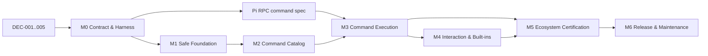

# pi-acp 命令与插件兼容性实施追踪器

> Plan ID: `PACP-CMD-2026-01`  
> 状态: `active`  
> 最后更新: 2026-07-31  
> 目标仓库: `Eric-Song-Nop/pi-acp`  
> 路径: `docs/command-compatibility/TRACKER.md`  
> 总控 issue: [#1](https://github.com/Eric-Song-Nop/pi-acp/issues/1)

## 0. 使用方式

这份文件既是实施路线图，也是长期状态源。Checkpoint ID 一经发布不再重命名；
新增工作使用新 ID，不通过改名复用旧 ID。

`DEC-001` 已完成，fork 的 GitHub Issues 已开启：

- 本文件是唯一状态源；
- [总控 issue #1](https://github.com/Eric-Song-Nop/pi-acp/issues/1) 只镜像本文件，
  用于发现、讨论和关联实现 issue；
- 每次实现 PR 必须同步更新本文件中的状态、证据和兼容版本；
- 不在聊天、临时看板和多个文档中维护重复状态。

创建实现 issue 时：

- 每个实现 issue 标题以 `[C2.3]` 这类稳定 ID 开头；
- milestone 表示交付阶段，issue 表示 0.5–3 天可验证工作；
- 只有同时活跃的并行 issue 超过约 15 个时才增加 GitHub Project。

## 1. 成功契约

### 1.1 目标

实现“**headless-compatible Pi commands and extensions over ACP**”：

1. 严格 ACP 客户端能发现并调用兼容的 Pi 内建命令和插件命令。
2. 已知 Pi 命令不会被静默当作普通提示词发送给模型。
3. 每次命令调用只完成一次；无 LLM 命令、异常、取消和超时都不会挂住会话。
4. 插件命令的来源、兼容级别、参数提示和失败原因可诊断。
5. 插件 reload、动态命令和 session/model 变化能刷新 ACP 状态。
6. select/confirm/input/editor 使用 ACP 能力协商和 elicitation，而不是伪装成工具权限。
7. project trust 永不被隐式授予。

### 1.2 明确不承诺

标准 ACP 不承诺复刻以下 Pi TUI 能力：

- 任意 `ui.custom()` component、overlay、游戏；
- 自定义 editor/header/footer、raw key handler、autocomplete、theme；
- 完整终端 ownership、statusline/widget 的像素级一致性；
- 未声明兼容性且未经测试的任意第三方插件。

这些能力必须采用客户端专用 `_pi/*` 扩展、外部 Web UI，或“一键打开 Pi TUI”兜底。

### 1.3 不可破坏的安全约束

- 不默认传递 `--approve`，不自动信任项目插件。
- 插件仍是拥有本地进程权限的代码；ACP permission 不能被描述成插件沙箱。
- extension stderr/diagnostics 可见，但必须限长、结构化，并避免把凭据原样写入客户端消息。
- TUI-only 或兼容性未知的命令不得伪装成“已完整支持”。

## 2. 当前基线

| 组件               | 已知基线                          | 状态/证据                                              |
| ------------------ | --------------------------------- | ------------------------------------------------------ |
| fork               | `Eric-Song-Nop/pi-acp@d1cffc0`    | 与 `svkozak/pi-acp` 主分支差异 `0 0`                   |
| pi-acp package     | `0.0.33`                          | 当前源码基线                                           |
| ACP SDK            | `@agentclientprotocol/sdk@0.26.0` | 已含 experimental elicitation；升级到 1.x 必须单独进行 |
| Pi                 | `0.80.5`–`0.83.0`                 | `C0.2` 固定目标窗口；完整兼容性由 `G5` 证明            |
| Node               | `>=22.19.0`                       | 与受测 Pi 的最低 engine 一致；E2E 单独建矩阵           |
| existing tests     | 104/104 通过                      | 含 C0.2/C0.4 contract tests；尚不能证明真实插件兼容    |
| Pi built-ins       | 22 个                             | pi-acp 只公布 8 个 adapter commands，精确重合 5 个     |
| extension commands | Pi RPC 可发现                     | pi-acp 在 new/load 两处显式过滤                        |
| GitHub Issues      | enabled                           | `DEC-001` accepted；总控 issue `#1`                    |

每次发布必须记录完整 compatibility tuple：

```text
pi-acp SHA/version × Pi CLI version × ACP SDK/protocol × Node × ACP client/version
```

## 3. 状态模型

| 状态        | 含义           | 进入条件                    | 退出条件                      |
| ----------- | -------------- | --------------------------- | ----------------------------- |
| `proposed`  | 已记录、未排期 | 有目标草案                  | 范围、验收、依赖已明确        |
| `ready`     | 可领取         | 依赖满足、验收可执行        | owner 开始实施                |
| `active`    | 正在实施       | owner 已确认                | PR 提交或发现硬阻塞           |
| `blocked`   | 硬依赖未满足   | 写明 blocker/owner/复查日期 | 依赖解除或选择 fallback       |
| `in_review` | 等待验收       | PR、测试、证据已链接        | 所有 acceptance criteria 通过 |
| `verified`  | 已复现完成     | gate 通过                   | checkpoint 关闭但保留记录     |
| `deferred`  | 显式延后       | 写明理由                    | 触发重新评估条件              |

规则：

- 不使用“完成 80%”一类百分比。
- `blocked` 必须链接 `DEC-*`、`X-*` 或具体 issue/PR，并给出下次检查日期。
- `verified` 必须有永久 commit/PR 链接和可复现测试证据。
- 截图可证明 UI 外观，不能单独证明安全、命令完成或 session 一致性。

## 4. 待决策事项

| ID        | 决策                           | 建议                                                                                                          | 状态       | 必须在何时完成   |
| --------- | ------------------------------ | ------------------------------------------------------------------------------------------------------------- | ---------- | ---------------- |
| `DEC-001` | 长期 tracker 放哪里            | 开启 fork Issues；仓库内本文件仍为最终状态源                                                                  | `accepted` | 2026-07-31       |
| `DEC-002` | 命令架构                       | 保留每 session 一个真实 Pi subprocess；推动 Pi RPC `execute_command`，adapter 保持薄层                        | `accepted` | 2026-07-31       |
| `DEC-003` | extension command 默认曝光策略 | `rpc-native/basic-dialog/external-ui` 默认显示；`tui-only` 隐藏；`unknown` 显示实验警告或受 feature flag 控制 | `accepted` | 2026-07-31       |
| `DEC-004` | project trust UX               | 明确用户批准；从不隐式 `--approve`                                                                            | `accepted` | 2026-07-31       |
| `DEC-005` | 首批支持客户端                 | raw ACP harness + Zed strict behavior + 至少一个非 Zed 客户端                                                 | `accepted` | 2026-07-31       |
| `DEC-006` | TUI-only fallback              | 默认给出清楚的“不支持/打开 TUI”路径；客户端专用 `_pi/*` 延后                                                  | `proposed` | `C4.6` 前        |
| `DEC-007` | 上游阻塞 fallback              | 上游硬阻塞 14 天后，必须在等待、维护小补丁、pin Pi、缩减范围中选一个                                          | `proposed` | 第一次上游阻塞时 |

只在跨模块、长期、安全或协议边界变化时写 ADR：

- `ADR-001`: subprocess + Pi RPC vs SDK worker/native ACP；
- `ADR-002`: command exposure 与兼容等级；
- `ADR-003`: project trust；
- `ADR-004`: 自定义 ACP UI 方法（若采用）。

## 5. 里程碑和关键路径

| Milestone                    | 结果                                             | 粗略工作量（单工程师） | Exit gate |
| ---------------------------- | ------------------------------------------------ | ---------------------: | --------- |
| `M0 Contract & Harness`      | 可复现基线、契约、真实 fixture harness           |                 3–5 天 | `G0`      |
| `M1 Safe Foundation`         | 不再静默失败，不把已知命令误发给模型             |                 3–5 天 | `G1`      |
| `M2 Command Catalog`         | 严格客户端能看到正确且动态的命令目录             |                 5–8 天 | `G2`      |
| `M3 Command Execution`       | 结构化执行结果、exactly-once、无挂起             |    7–15 天，受上游影响 | `G3`      |
| `M4 Interaction & Built-ins` | elicitation、关键 Pi 内建命令、显式 TUI fallback |                7–12 天 | `G4`      |
| `M5 Ecosystem Certification` | 真实插件、客户端和版本矩阵通过                   |                 5–8 天 | `G5`      |
| `M6 Release & Maintenance`   | 文档、回滚、upstream、RC/GA 和持续回归           |                 3–5 天 | `G6`      |

这些是范围估算，不是发布日期承诺。完整标准 headless GA 若由一个工程师承担，
更保守的估算是 10–16 周；Pi 与 pi-acp 两人并行约 6–10 个日历周，另加上游
review/release 等待。`M1 + M2` 可更早提供 experimental preview。



Pi RPC spec/上游实现可以与 `M1/M2` 并行；在 `G3` 之前不得把所有 extension
commands 宣称为稳定支持。

## 6. Master checkpoint table

| ID     | Outcome                                                           | 当前状态    | Hard dependencies         | Gate      |
| ------ | ----------------------------------------------------------------- | ----------- | ------------------------- | --------- |
| `C0.1` | tracker 合入仓库并决定 Issues 策略                                | `in_review` | `DEC-001`                 | `G0`      |
| `C0.2` | 固定 compatibility tuple 与受测版本窗口                           | `in_review` | —                         | `G0`      |
| `C0.3` | CI 跑 typecheck/lint/unit/build 和 E2E 基础矩阵                   | `proposed`  | `C0.2`                    | `G0`      |
| `C0.4` | 定义 command compatibility schema                                 | `in_review` | `DEC-003`                 | `G0`      |
| `C0.5` | raw ACP + strict-client harness                                   | `proposed`  | `DEC-005`                 | `G0`      |
| `C0.6` | 建立真实 Pi fixture extension pack                                | `proposed`  | `C0.5`                    | `G0`      |
| `C0.7` | 记录当前失败基线和 immutable transcripts                          | `proposed`  | `C0.3`, `C0.6`            | `G0`      |
| `C1.1` | extension stderr/load diagnostics 可见且安全限长                  | `proposed`  | `C0.7`                    | `G1`      |
| `C1.2` | `extension_error` 映射为可见、可测试错误                          | `proposed`  | `C0.7`                    | `G1`      |
| `C1.3` | Pi child 退出时 fail pending command，并提供确定恢复路径          | `proposed`  | `C0.5`                    | `G1`      |
| `C1.4` | 使用严格 LF JSONL reader                                          | `proposed`  | `C0.3`                    | `G1`      |
| `C1.5` | 已知但未实现的 Pi built-in 被明确拒绝，不进入 LLM                 | `proposed`  | `C0.4`                    | `G1`      |
| `C1.6` | trust/loaded extensions/command source 可诊断，无隐式批准         | `proposed`  | `DEC-004`, `C1.1`         | `G1`      |
| `C1.7` | startup readiness 与 early-event buffering                        | `proposed`  | `C0.6`                    | `G1`      |
| `C2.1` | 保存 ACP client capabilities                                      | `proposed`  | `C0.4`                    | `G2`      |
| `C2.2` | Pi 成为唯一 slash command/router；删除 adapter 提前展开           | `proposed`  | `C0.7`                    | `G2`      |
| `C2.3` | 公布兼容 extension commands 并保留 source/compatibility           | `proposed`  | `DEC-003`, `C1.2`, `C2.2` | `G2`      |
| `C2.4` | 定义 collision、reserved names 和稳定 ID 规则                     | `proposed`  | `C0.4`, `C2.2`            | `G2`      |
| `C2.5` | reload/runtime registration 后刷新命令目录                        | `proposed`  | `C2.3`                    | `G2`      |
| `C2.6` | argument hints/completions 进入 Pi RPC/ACP metadata               | `proposed`  | `C3.1`                    | `G2`      |
| `C2.7` | extension flags 进入明确的 CLI/ACP config 通路                    | `proposed`  | `DEC-002`                 | `G2`      |
| `C3.1` | 审核并冻结 Pi RPC command catalog/execute spec                    | `proposed`  | `DEC-002`, `C0.6`         | `G3`      |
| `C3.2` | Pi 实现 `execute_command` + request/disposition identity          | `proposed`  | `C3.1`                    | `G3`      |
| `C3.3` | pi-acp bridge 结构化 command results                              | `proposed`  | `C3.2`                    | `G3`      |
| `C3.4` | state-only/no-LLM/handled-input commands 正确完成                 | `proposed`  | `C3.3`                    | `G3`      |
| `C3.5` | agent-triggering commands 等待正确 run 后只完成一次               | `proposed`  | `C3.3`                    | `G3`      |
| `C3.6` | throw/cancel/timeout 无泄漏、无重复完成                           | `proposed`  | `C3.3`                    | `G3`      |
| `C3.7` | streaming 中的 immediate command/steer/follow-up 语义明确         | `proposed`  | `C3.3`                    | `G3`      |
| `C3.8` | new/switch/fork/reload 后 ACP session 映射与目录同步              | `proposed`  | `C3.3`, `C2.5`            | `G3`      |
| `C4.1` | elicitation form/url capability negotiation                       | `proposed`  | `C2.1`                    | `G4`      |
| `C4.2` | select/confirm 不再滥用 permission request                        | `proposed`  | `C4.1`                    | `G4`      |
| `C4.3` | input/editor 支持 accept/decline/cancel/timeout                   | `proposed`  | `C4.1`, `C3.6`            | `G4`      |
| `C4.4` | notify/status/title/string-widget 采用可降级映射                  | `proposed`  | `C2.1`                    | `G4`      |
| `C4.5` | external URL/Web sidecar 命令有安全绑定与回写路径                 | `proposed`  | `C4.1`                    | `G4`      |
| `C4.6` | TUI-only 命令不误宣传，并提供清楚 fallback                        | `proposed`  | `DEC-006`, `C0.4`         | `G4`      |
| `C4.7` | `/trust`, `/reload`, `/login`, `/logout` 有明确支持路径           | `proposed`  | `C1.6`, `C3.8`, `C4.1`    | `G4`      |
| `C4.8` | `/fork`, `/clone`, `/tree`, `/new`, `/resume` 与 ACP session 对齐 | `proposed`  | `C3.8`                    | `G4`      |
| `C4.9` | 其余 Pi built-ins 支持、ACP-native 替代或明确拒绝                 | `proposed`  | `C1.5`, `C4.8`            | `G4`      |
| `C5.1` | 官方 commands/rpc-demo/plan/todo/input-transform fixtures         | `proposed`  | `G4`                      | `G5`      |
| `C5.2` | `pi-mcp-adapter` 支持子集认证                                     | `proposed`  | `G4`                      | `G5`      |
| `C5.3` | Narumiruna Chrome/accounts/statusline/subagents 认证              | `proposed`  | `G4`                      | `G5`      |
| `C5.4` | Plannotator/external Web UI 认证                                  | `proposed`  | `C4.5`                    | `G5`      |
| `C5.5` | Browser/CDP tool image/result 显示认证                            | `proposed`  | `C4.4`                    | `G5`      |
| `C5.6` | raw ACP、Zed、至少一个非 Zed client 矩阵                          | `proposed`  | `C5.1..5`                 | `G5`      |
| `C5.7` | Pi min/base/head 与 ACP SDK legacy/current 版本矩阵               | `proposed`  | `C0.2`, `C5.6`            | `G5`      |
| `C5.8` | trust、日志、外部 URL 和本地权限边界安全审查                      | `proposed`  | `C1.6`, `C4.5`            | `G5`      |
| `C6.1` | 用户文档、支持矩阵、known limitations                             | `proposed`  | `G5`                      | `G6`      |
| `C6.2` | experimental flags、kill switch、pin/rollback 指南                | `proposed`  | `G5`                      | `G6`      |
| `C6.3` | upstream PR 拆分、permalink 和补丁删除条件                        | `proposed`  | `C3.2`, `C6.1`            | `G6`      |
| `C6.4` | ACP SDK 0.26 → 1.x 独立迁移（不混入行为 PR）                      | `proposed`  | `G5`                      | `G6`      |
| `C6.5` | RC compatibility tuple 和 release notes                           | `proposed`  | `C6.1..4`                 | `G6`      |
| `C6.6` | 每周 version watch 与每次发布回归协议                             | `proposed`  | `C6.5`                    | recurring |

## 7. Checkpoint 验收细则

### M0 — Contract & Harness

#### `C0.1` Tracker

- [x] 本文件进入 fork，并从 README 可发现。
- [x] `DEC-001` 完成；fork Issues 已开启，总控 issue 只镜像本文件。
- [x] checkpoint ID、状态定义、证据规则和周更模板冻结。

#### `C0.2` Compatibility tuple

- [x] 记录 adapter、Pi、ACP SDK、Node、Zed 和另一客户端的精确版本/SHA。
- [x] 将开放式 Pi 版本改成 `0.80.5`–`0.83.0` 窗口，超出窗口 best effort。
- [x] 本 checkpoint 未升级 Pi 或 ACP SDK；两条版本轴仍要求使用独立 PR。

证据：
[`BASELINE.md`](BASELINE.md)、
[`test/e2e/compatibility-matrix.json`](../../test/e2e/compatibility-matrix.json)
和 `test/unit/compatibility-matrix.test.ts`。

#### `C0.4` Command compatibility schema

- [x] 冻结 source、compatibility、execution、exposure、interaction 和 evidence vocabulary。
- [x] `tui-only` 永远 hidden；`unknown` 不得 stable；stable 必须有 headless tier 和证据。
- [x] 默认曝光策略实现 `DEC-003`，unknown 只能通过显式实验路径并携带 warning。
- [x] ACP metadata 只导出 opaque ID/tier，不导出本地路径或 evidence 细节。
- [x] Zod contract、JSON Schema companion、文档和 unit tests 使用同一 vocabulary。

证据：
[`COMMAND_SCHEMA.md`](COMMAND_SCHEMA.md)、
[`command-compatibility.schema.json`](command-compatibility.schema.json)、
`src/acp/command-compatibility.ts`
和 `test/unit/command-compatibility.test.ts`。

#### `C0.3, C0.5–C0.7` Harness 与失败基线

- [ ] CI 分别运行 `typecheck`, `lint`, `test`, `build`。
- [ ] E2E 使用真实 Pi 子进程，不只使用 `FakePiRpcProcess`。
- [ ] 每个 case 使用独立 cwd 和 `PI_CODING_AGENT_DIR`，不读取开发者真实 Pi 配置。
- [ ] agent-turn fixture 使用 loopback deterministic provider，不消耗真实模型账户。
- [ ] 阻塞 CI 默认禁止外网；插件、Pi 和客户端版本全部 pin。
- [ ] strict-client harness 会拒绝未出现在 `available_commands_update` 的 slash command。
- [ ] 所有可能挂起的用例有硬 timeout，并保存 NDJSON transcript。
- [ ] 当前已知失败被记录为测试，不以“人工知道会坏”代替。

### M1 — Safe Foundation

- [ ] extension factory/load/runtime errors 在客户端或 debug artifact 中可找到 source path。
- [ ] child exit、broken pipe 和 `extension_error` 不留下永久 pending request。
- [ ] `/trust`、`/reload` 等已知未实现命令不会进入模型上下文。
- [ ] trust 状态清楚区分 `trusted/untrusted/unknown`；默认永不批准。
- [ ] 早期 UI/event 不被 `get_state` handshake 或 handler 安装顺序吞掉。
- [ ] 日志和错误输出有长度上限、敏感值处理和测试。

### M2 — Command Catalog

- [ ] Zed-style strict client 能看到所有“应显示”的 extension commands。
- [ ] TUI-only 命令默认不显示；unknown 命令遵守 `DEC-003`。
- [ ] prompt/skill/extension/builtin 同名行为由一条确定规则控制，展示与执行一致。
- [ ] reload 和动态注册后，客户端在测试 timeout 内收到更新目录。
- [ ] command source、description、argument hint 和兼容等级可追踪。
- [ ] adapter 不再用过时的 `$1/$@` 展开逻辑抢在 Pi router 前执行。

### M3 — Command Execution

- [ ] local/no-LLM command 在自身工作完成后返回一次 ACP response。
- [ ] agent-triggering command 在属于该 request 的 run settled 后返回一次。
- [ ] throwing command 返回可见 error；不会先报告成功再永久 pending。
- [ ] cancel、timeout、child exit 和 reload 都只结束 request 一次。
- [ ] PR 连续/并发压力运行 100 次、nightly 1000 次；无错误 resolve 到下一条命令。
- [ ] streaming 中的 command、steer 和 follow-up 与 Pi 的文档语义一致。
- [ ] session-changing command 后，ACP session ID、Pi session file、title、commands 和 model 状态一致。

### M4 — Interaction & Built-ins

- [ ] form-capable client 完成 select/confirm/input/editor 的 accept/decline/cancel。
- [ ] 不支持 elicitation 的 client 获得明确 fallback，不静默伪造输入。
- [ ] timeout/abort 会取消对应 UI request；迟到 response 不污染下一条命令。
- [ ] `/trust`, `/reload`, `/login`, `/logout` 有可测试、可解释的路径。
- [ ] 所有 22 个 Pi built-ins 均有一种状态：`supported`、`ACP-native replacement`、
      `explicitly unsupported`；不得留为 silent fallthrough。
- [ ] 外部 Web UI 具有一次性 request/session 绑定，不在消息中泄露敏感 token。

### M5 — Ecosystem Certification

每个第三方插件必须 pin commit/version，只认证明确支持的子集。

通过定义：

- 支持子命令全部通过 raw + strict client；
- TUI-only 子命令被正确隐藏或明确拒绝；
- 不将“插件某些 tools 能运行”误写成“插件完全兼容”；
- 每个失败都有 checkpoint/issue、owner 和重新评估触发条件。

### M6 — Release

- [ ] README 有支持等级、客户端矩阵、版本窗口、trust/security 说明。
- [ ] 可以通过一个 kill switch 关闭 experimental extension commands。
- [ ] 记录回滚步骤：关闭 feature、pin Pi、退回前一 adapter、打开 TUI。
- [ ] upstream patch 记录基于 SHA、对应 issue/PR 和删除补丁的目标版本。
- [ ] RC 在全新环境重复安装和验证，不依赖开发机已有配置。

## 8. Fixture 和兼容矩阵

### 8.1 自有 fixture extensions

| ID      | Fixture                         | 必须验证                                     |
| ------- | ------------------------------- | -------------------------------------------- |
| `FX-01` | local notify/state-only command | 执行、可见输出、立即完成、不挂起             |
| `FX-02` | agent-triggering command        | 正确关联 run，只完成一次                     |
| `FX-03` | throwing command                | source-aware error、request 结束             |
| `FX-04` | `input` hook returns `handled`  | 无 LLM 仍正确完成                            |
| `FX-05` | select/confirm/input/editor     | 四种 UI、取消、超时、迟到响应                |
| `FX-06` | dynamic register + reload       | commands_changed、稳定目录                   |
| `FX-07` | duplicate/reserved names        | collision ID 稳定，显示与执行一致            |
| `FX-08` | new/switch/fork/reload/quit     | session mapping、cleanup、恢复               |
| `FX-09` | background `sendUserMessage`    | 不错误结束相邻 ACP request                   |
| `FX-10` | flags + shortcut                | flag 有 ACP/CLI 路径；shortcut 明确 TUI-only |
| `FX-11` | `ui.custom()`/overlay           | 不广告或明确 fallback，不假装成功            |
| `FX-12` | image-producing custom tool     | ACP 可见 image content，不只 raw output      |

每个 verification 项额外记录：

```text
status: todo | in_progress | blocked | in_review | verified | regressed | waived | retired
evidence: CI URL / trace artifact / commit SHA
verifiedAgainst: pi-acp × Pi × ACP SDK × Node × client × plugin
lastVerifiedAt:
waiverReason / expiry:
```

`waived` 必须有到期日；已知故障使用 `xfail(issue)`，修复后必须翻转成正常断言，
不得永久 `skip`。

### 8.2 真实插件

| 目标                                  | 认证范围                                  | 明确排除               |
| ------------------------------------- | ----------------------------------------- | ---------------------- |
| Pi official `commands/rpc-demo`       | catalog、dialogs、errors                  | arbitrary TUI          |
| Pi official plan/todo/input-transform | tools、state、headless commands           | custom todo panel      |
| `pi-mcp-adapter`                      | text subcommands、动态 prompts、auth 子集 | `ui.custom()` panels   |
| Narumiruna Chrome DevTools            | text + select menu                        | TUI-only decorations   |
| Narumiruna accounts                   | form input + provider refresh             | 未映射的 native UI     |
| Narumiruna statusline/subagents       | status/help/tools                         | statusline/manager UI  |
| Plannotator                           | external browser flow + safe callback     | Pi TUI parity          |
| Browser/CDP extension                 | tool execution + screenshot output        | custom renderer parity |

### 8.3 客户端和版本轴

| 轴                  | 必测                                                   | 说明                            |
| ------------------- | ------------------------------------------------------ | ------------------------------- |
| ACP client behavior | raw permissive、strict catalog client、Zed、另一客户端 | 自动矩阵 + RC 手测              |
| Pi                  | `PI_MIN`、`PI_BASE`、`PI_HEAD` informational           | 只对前两者承诺；head 失败只报警 |
| ACP SDK             | 当前 0.26、候选 1.x                                    | 分开 PR、分开证据               |
| Node                | adapter 最低、Pi E2E 所需版本                          | unit 与 E2E 可使用不同 job      |
| OS                  | Linux CI、macOS smoke；Windows 按发布范围决定          | subprocess/shell 路径需单测     |

每个 case 完成后运行一个 liveness probe：`/fx-ping` 必须在 2 秒内结束；session
close 后 2 秒内不得残留 Pi child、loopback port、browser/MCP/subagent worker。

Pi 上游 22 个 built-in command 每个都必须有稳定 verification ID，并归入：

1. `advertised-and-executable`；
2. `ACP-native replacement`；
3. `hidden/explicitly unsupported`。

nightly 对 Pi upstream built-in 清单做 drift check；新增名字必须使 canary 失败并要求
明确归类，不能被静默遗漏。

## 9. Release gates

Gate 不能靠“豁免通过”。如果某能力未达到 gate，只能：

1. 修复；
2. 从稳定范围移到明确 experimental flag；
3. 缩小支持契约；
4. 延后发布。

| Gate               | 通过条件                                                                                                            |
| ------------------ | ------------------------------------------------------------------------------------------------------------------- |
| `G0 Contract`      | tracker 入库；决策、版本 tuple、fixture、失败基线和支持边界完整                                                     |
| `G1 Safety`        | 无隐式 trust；错误/来源可诊断；child exit 不挂起；已知 built-in 不进入 LLM                                          |
| `G2 Catalog`       | 严格客户端目录正确；collision/动态刷新/来源/兼容级别一致                                                            |
| `G3 Execution`     | no-LLM、agent-run、throw、cancel、reload、handled input 均 exactly once；PR 100 次、nightly 1000 次无挂起或重复终态 |
| `G4 Interaction`   | elicitation 与 fallback 可验证；关键生态 built-ins 可用；TUI-only 不误宣传                                          |
| `G5 Compatibility` | 现有 95 tests + fixture + pinned real plugins；raw、Zed、另一客户端完成矩阵                                         |
| `G6 Delivery`      | 文档、compat tuple、changelog、升级/回滚、upstream 状态和 RC 安装验证齐全                                           |

核心量化指标：

- 已公布命令可执行精确率 `100%`；
- 目标 compatibility tier 的命令目录召回率 `100%`；
- local handler 返回到 ACP local completion `≤500ms`，整条 local case 硬超时 `2s`；
- cancel 到终态 `≤2s`；
- catalog change 到 client update `≤1s`；
- unknown/unsupported command 误送模型 `0`；
- CI 访问真实账户、真实 Pi home 和外网 `0`；
- session close 后遗留进程/端口 `0`。

## 10. 上游依赖账本

| ID     | 上游事项                                | 本计划映射             | 处理原则                                   |
| ------ | --------------------------------------- | ---------------------- | ------------------------------------------ |
| `X-01` | pi-acp PR #20 extension commands        | `C2.3`                 | 不能单独合并为稳定支持                     |
| `X-02` | pi-acp PR #21 forward Pi args           | `C2.7`, `C4.7`         | 补 trust/flags，但不默认 approve           |
| `X-03` | pi-acp issue #84 no-LLM command hangs   | `C3.4`                 | `G3` 硬阻塞                                |
| `X-04` | pi-acp PR #53 reload                    | `C2.5`, `C3.8`, `C4.7` | 需命令/状态重同步                          |
| `X-05` | pi-acp PR #41 strict LF reader          | `C1.4`                 | 可独立低风险落地                           |
| `X-06` | pi-acp PR #47 error forwarding          | `C1.2`                 | 需 extension source 和测试                 |
| `X-07` | pi-acp PR #83 dead child recovery       | `C1.3`                 | 必须验证 pending command                   |
| `X-08` | pi-acp PR #60/#89 session updates       | `C3.8`, `C4.4`         | 统一后选择，不重复实现                     |
| `X-09` | pi-acp PR #91 steering                  | `C3.7`                 | 与 adapter 自有 queue 一起审查             |
| `X-10` | Pi RPC command catalog/execute proposal | `C3.1–3`               | 新建 upstream issue/PR，使用 SHA permalink |

任何上游 patch 都必须记录：

- 基于哪个 upstream SHA；
- 临时 patch 所在分支/commit；
- 对应 upstream issue/PR；
- 何时删除本地 patch；
- 超过 14 天无进展时采用 `DEC-007`。

## 11. Issue / PR 模板

```md
## [C?.?] Outcome

State: proposed
Owner:
Milestone:
Gate:

Hard-depends-on:
Soft-depends-on:
Upstream-depends-on:
Unblocks:

### Goal

### In scope

### Explicitly out of scope

### Acceptance criteria

- [ ]

### Test/evidence plan

- Automated:
- Manual compatibility tuple:
- Permanent source links:

### Security / failure modes

### Rollback

### Evidence on completion

- PR/commit:
- CI:
- Transcript/artifact:
- Tracker update:
```

一个 PR 默认对应一个 checkpoint issue；只有紧密耦合且无法独立验收时才合并。

## 12. 每周更新和版本变更

只在 milestone 活跃时每周更新一次。先更新 checkpoint 表，再写周报：

```md
### Week of YYYY-MM-DD

- Verified:
- State changes:
- New evidence:
- Blockers / decisions needed:
- Version watch:
- Critical path for next week (max 3):
```

版本变更规则：

- 一次 PR 只移动一个版本轴。
- ACP SDK 用 lockfile 固定；0.26 → 1.x 使用独立 checkpoint/PR。
- Pi minor release 也按潜在 breaking change 处理。
- 只声明实际跑过 `G5` 的 Pi/client 版本。
- Pi 更新重点重跑 trust、RPC startup、commands、session replacement。
- ACP 更新重点重跑 capabilities、elicitation、slash commands、permission semantics。
- 依赖升级不自动合并。

## 13. 第一批可领取工作

完成 `DEC-001..005` 后，建议并行启动：

1. `C0.3 + C0.5 + C0.6`：CI、raw/strict harness、fixture pack；
2. `C1.4`：strict LF reader；
3. `C1.1 + C1.2`：diagnostics/error forwarding；
4. `C3.1`：与 Pi 上游设计 command catalog/execute protocol；
5. `C1.5`：已知 Pi built-ins 显式拒绝，阻止误发模型。

不要把“合并 PR #20、显示所有 extension commands”作为第一步；它必须至少等到
`C1.2`, `C2.2`, `C3.4` 有实验实现和 fixture 证据后再进入公开 preview。
