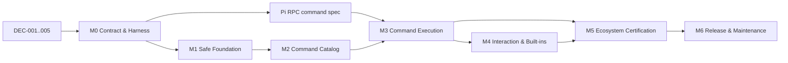

# pi-acp 命令与插件兼容性实施追踪器

> Plan ID: `PACP-CMD-2026-01`  
> 状态: `active`  
> 最后更新: 2026-07-31  
> 目标仓库: `Eric-Song-Nop/pi-acp`  
> 路径: `docs/command-compatibility/TRACKER.md`  
> 总控 issue: [#1](https://github.com/Eric-Song-Nop/pi-acp/issues/1)

## 0. 使用方式

这份文件既是实施路线图，也是长期状态源。Checkpoint ID 一经发布不再重命名；
新增工作使用新 ID，不通过改名复用旧 ID。

`DEC-001` 已完成，fork 的 GitHub Issues 已开启：

- 本文件是唯一状态源；
- [总控 issue #1](https://github.com/Eric-Song-Nop/pi-acp/issues/1) 只镜像本文件，
  用于发现、讨论和关联实现 issue；
- 每次实现 PR 必须同步更新本文件中的状态、证据和兼容版本；
- 不在聊天、临时看板和多个文档中维护重复状态。

创建实现 issue 时：

- 每个实现 issue 标题以 `[C2.3]` 这类稳定 ID 开头；
- milestone 表示交付阶段，issue 表示 0.5–3 天可验证工作；
- 只有同时活跃的并行 issue 超过约 15 个时才增加 GitHub Project。

## 1. 成功契约

### 1.1 目标

实现“**headless-compatible Pi commands and extensions over ACP**”：

1. 严格 ACP 客户端能发现并调用兼容的 Pi 内建命令和插件命令。
2. 已知 Pi 命令不会被静默当作普通提示词发送给模型。
3. 每次命令调用只完成一次；无 LLM 命令、异常、取消和超时都不会挂住会话。
4. 插件命令的来源、兼容级别、参数提示和失败原因可诊断。
5. 插件 reload、动态命令和 session/model 变化能刷新 ACP 状态。
6. select/confirm/input/editor 使用 ACP 能力协商和 elicitation，而不是伪装成工具权限。
7. project trust policy 必须显式且可诊断；当前 `DEC-008` 产品策略会对每个 ACP 项目强制批准。

### 1.2 明确不承诺

标准 ACP 不承诺复刻以下 Pi TUI 能力：

- 任意 `ui.custom()` component、overlay、游戏；
- 自定义 editor/header/footer、raw key handler、autocomplete、theme；
- 完整终端 ownership、statusline/widget 的像素级一致性；
- 未声明兼容性且未经测试的任意第三方插件。

这些能力必须采用客户端专用 `_pi/*` 扩展、外部 Web UI，或“一键打开 Pi TUI”兜底。

### 1.3 不可破坏的安全约束

- 每个受支持的 Pi RPC process 必须精确传递一次 `--approve`；选择 ACP `cwd`
  即表示无需逐项目确认地信任该项目资源。这是 `DEC-008` 于 2026-08-02
  明确接受的产品策略；原 `DEC-004` 保留为已 supersede 的历史决定。
- 项目 settings、packages、prompts、skills 与 extensions 可使用 adapter process 的
  本地权限加载、安装或执行；ACP permission 不是插件沙箱，文档与诊断必须披露该边界。
- extension stderr/diagnostics 可见，但必须限长、结构化，并避免把凭据原样写入客户端消息。
- TUI-only 或兼容性未知的命令不得伪装成“已完整支持”。

## 2. 当前基线

| 组件               | 已知基线                          | 状态/证据                                              |
| ------------------ | --------------------------------- | ------------------------------------------------------ |
| upstream/fork base | `Eric-Song-Nop/pi-acp@d1cffc0`    | 与 `svkozak/pi-acp` 主分支差异 `0 0`                   |
| pi-acp package     | `0.0.33`                          | 当前源码基线                                           |
| ACP SDK            | `@agentclientprotocol/sdk@0.26.0` | 已含 experimental elicitation；升级到 1.x 必须单独进行 |
| Pi                 | `0.80.5`–`0.83.0`                 | `C0.2` 固定目标窗口；完整兼容性由 `G5` 证明            |
| Node               | `>=22.19.0`                       | 与受测 Pi 的最低 engine 一致；E2E 单独建矩阵           |
| existing tests     | 117/117 通过                      | 当前 C0.5 stacked head；尚不能证明真实插件兼容         |
| Pi built-ins       | 22 个                             | pi-acp 只公布 8 个 adapter commands，精确重合 5 个     |
| extension commands | Pi RPC 可发现                     | pi-acp 在 new/load 两处显式过滤                        |
| GitHub Issues      | enabled                           | `DEC-001` accepted；总控 issue `#1`                    |

每次发布必须记录完整 compatibility tuple：

```text
pi-acp SHA/version × Pi CLI version × ACP SDK/protocol × Node × ACP client/version
```

## 3. 状态模型

| 状态        | 含义           | 进入条件                    | 退出条件                      |
| ----------- | -------------- | --------------------------- | ----------------------------- |
| `proposed`  | 已记录、未排期 | 有目标草案                  | 范围、验收、依赖已明确        |
| `ready`     | 可领取         | 依赖满足、验收可执行        | owner 开始实施                |
| `active`    | 正在实施       | owner 已确认                | PR 提交或发现硬阻塞           |
| `blocked`   | 硬依赖未满足   | 写明 blocker/owner/复查日期 | 依赖解除或选择 fallback       |
| `in_review` | 等待验收       | PR、测试、证据已链接        | 所有 acceptance criteria 通过 |
| `verified`  | 已复现完成     | gate 通过                   | checkpoint 关闭但保留记录     |
| `deferred`  | 显式延后       | 写明理由                    | 触发重新评估条件              |

规则：

- 不使用“完成 80%”一类百分比。
- `blocked` 必须链接 `DEC-*`、`X-*` 或具体 issue/PR，并给出下次检查日期。
- `verified` 必须有永久 commit/PR 链接和可复现测试证据。
- 截图可证明 UI 外观，不能单独证明安全、命令完成或 session 一致性。

## 4. 待决策事项

| ID        | 决策                           | 建议                                                                                                          | 状态                    | 必须在何时完成   |
| --------- | ------------------------------ | ------------------------------------------------------------------------------------------------------------- | ----------------------- | ---------------- |
| `DEC-001` | 长期 tracker 放哪里            | 开启 fork Issues；仓库内本文件仍为最终状态源                                                                  | `accepted`              | 2026-07-31       |
| `DEC-002` | 命令架构                       | 保留每 session 一个真实 Pi subprocess；推动 Pi RPC `execute_command`，adapter 保持薄层                        | `accepted`              | 2026-07-31       |
| `DEC-003` | extension command 默认曝光策略 | `rpc-native/basic-dialog/external-ui` 默认显示；`tui-only` 隐藏；`unknown` 显示实验警告或受 feature flag 控制 | `accepted`              | 2026-07-31       |
| `DEC-004` | project trust UX（历史）       | 明确用户批准；从不隐式 `--approve`                                                                            | `superseded by DEC-008` | 2026-07-31       |
| `DEC-005` | 首批支持客户端                 | raw ACP harness + Zed strict behavior + 至少一个非 Zed 客户端                                                 | `accepted`              | 2026-07-31       |
| `DEC-006` | TUI-only fallback              | 默认给出清楚的“不支持/打开 TUI”路径；客户端专用 `_pi/*` 延后                                                  | `proposed`              | `C4.6` 前        |
| `DEC-007` | 上游阻塞 fallback              | 上游硬阻塞 14 天后，必须在等待、维护小补丁、pin Pi、缩减范围中选一个                                          | `proposed`              | 第一次上游阻塞时 |
| `DEC-008` | forced project approval        | 每个 new/load/recovery Pi RPC process 精确传一次 `--approve`；ACP `cwd` 无逐项目确认即可信，ACP 不是 sandbox  | `accepted`              | 2026-08-02       |

`DEC-004` 的 `superseded` 标记只用于保留 decision history，不是 checkpoint 状态；
当前规范以带独立日期和 ID 的 `DEC-008` 为准。

只在跨模块、长期、安全或协议边界变化时写 ADR：

- `ADR-001`: subprocess + Pi RPC vs SDK worker/native ACP；
- `ADR-002`: command exposure 与兼容等级；
- `ADR-003`: project trust；
- `ADR-004`: 自定义 ACP UI 方法（若采用）。

## 5. 里程碑和关键路径

| Milestone                    | 结果                                             | 粗略工作量（单工程师） | Exit gate |
| ---------------------------- | ------------------------------------------------ | ---------------------: | --------- |
| `M0 Contract & Harness`      | 可复现基线、契约、真实 fixture harness           |                 3–5 天 | `G0`      |
| `M1 Safe Foundation`         | 不再静默失败，不把已知命令误发给模型             |                 3–5 天 | `G1`      |
| `M2 Command Catalog`         | 严格客户端能看到正确且动态的命令目录             |                 5–8 天 | `G2`      |
| `M3 Command Execution`       | 结构化执行结果、exactly-once、无挂起             |    7–15 天，受上游影响 | `G3`      |
| `M4 Interaction & Built-ins` | elicitation、关键 Pi 内建命令、显式 TUI fallback |                7–12 天 | `G4`      |
| `M5 Ecosystem Certification` | 真实插件、客户端和版本矩阵通过                   |                 5–8 天 | `G5`      |
| `M6 Release & Maintenance`   | 文档、回滚、upstream、RC/GA 和持续回归           |                 3–5 天 | `G6`      |

这些是范围估算，不是发布日期承诺。完整标准 headless GA 若由一个工程师承担，
更保守的估算是 10–16 周；Pi 与 pi-acp 两人并行约 6–10 个日历周，另加上游
review/release 等待。`M1 + M2` 可更早提供 experimental preview。



Pi RPC spec/上游实现可以与 `M1/M2` 并行；在 `G3` 之前不得把所有 extension
commands 宣称为稳定支持。

## 6. Master checkpoint table

| ID     | Outcome                                                                       | 当前状态    | Hard dependencies         | Gate      |
| ------ | ----------------------------------------------------------------------------- | ----------- | ------------------------- | --------- |
| `C0.1` | tracker 合入仓库并决定 Issues 策略                                            | `in_review` | `DEC-001`                 | `G0`      |
| `C0.2` | 固定 compatibility tuple 与受测版本窗口                                       | `in_review` | —                         | `G0`      |
| `C0.3` | CI 跑 typecheck/lint/unit/build 和 E2E 基础矩阵                               | `verified`  | `C0.2`                    | `G0`      |
| `C0.4` | 定义 command compatibility schema                                             | `verified`  | `DEC-003`                 | `G0`      |
| `C0.5` | raw ACP + strict-client harness                                               | `verified`  | `DEC-005`                 | `G0`      |
| `C0.6` | 建立真实 Pi fixture extension pack                                            | `verified`  | `C0.5`                    | `G0`      |
| `C0.7` | 记录当前失败基线和 immutable transcripts                                      | `verified`  | `C0.3`, `C0.6`            | `G0`      |
| `C1.1` | extension stderr/load diagnostics 可见且安全限长                              | `verified`  | `C0.7`                    | `G1`      |
| `C1.2` | `extension_error` 映射为可见、可测试错误                                      | `verified`  | `C0.7`                    | `G1`      |
| `C1.3` | Pi child 退出时 fail pending command，并提供确定恢复路径                      | `verified`  | `C0.5`                    | `G1`      |
| `C1.4` | 使用严格 LF JSONL reader                                                      | `verified`  | `C0.3`                    | `G1`      |
| `C1.5` | 已知但未实现的 Pi built-in 被明确拒绝，不进入 LLM                             | `verified`  | `C0.4`                    | `G1`      |
| `C1.6` | 所有项目强制批准，并在 child start 后固定披露 trust/local-permission boundary | `verified`  | `DEC-008`, `C1.1`         | `G1`      |
| `C1.7` | startup readiness 与 early-event buffering                                    | `proposed`  | `C0.6`                    | `G1`      |
| `C2.1` | 保存 ACP client capabilities                                                  | `proposed`  | `C0.4`                    | `G2`      |
| `C2.2` | Pi 成为唯一 slash command/router；删除 adapter 提前展开                       | `verified`  | `C0.7`                    | `G2`      |
| `C2.3` | 公布兼容 extension commands 并保留 source/compatibility                       | `proposed`  | `DEC-003`, `C1.2`, `C2.2` | `G2`      |
| `C2.4` | 定义 collision、reserved names 和稳定 ID 规则                                 | `proposed`  | `C0.4`, `C2.2`            | `G2`      |
| `C2.5` | reload/runtime registration 后刷新命令目录                                    | `proposed`  | `C2.3`                    | `G2`      |
| `C2.6` | argument hints/completions 进入 Pi RPC/ACP metadata                           | `proposed`  | `C3.1`                    | `G2`      |
| `C2.7` | extension flags 进入明确的 CLI/ACP config 通路                                | `proposed`  | `DEC-002`                 | `G2`      |
| `C3.1` | 审核并冻结 Pi RPC command catalog/execute spec                                | `proposed`  | `DEC-002`, `C0.6`         | `G3`      |
| `C3.2` | Pi 实现 `execute_command` + request/disposition identity                      | `proposed`  | `C3.1`                    | `G3`      |
| `C3.3` | pi-acp bridge 结构化 command results                                          | `proposed`  | `C3.2`                    | `G3`      |
| `C3.4` | state-only/no-LLM/handled-input commands 正确完成                             | `proposed`  | `C3.3`                    | `G3`      |
| `C3.5` | agent-triggering commands 等待正确 run 后只完成一次                           | `proposed`  | `C3.3`                    | `G3`      |
| `C3.6` | throw/cancel/timeout 无泄漏、无重复完成                                       | `proposed`  | `C3.3`                    | `G3`      |
| `C3.7` | streaming 中的 immediate command/steer/follow-up 语义明确                     | `proposed`  | `C3.3`                    | `G3`      |
| `C3.8` | new/switch/fork/reload 后 ACP session 映射与目录同步                          | `proposed`  | `C3.3`, `C2.5`            | `G3`      |
| `C4.1` | elicitation form/url capability negotiation                                   | `proposed`  | `C2.1`                    | `G4`      |
| `C4.2` | select/confirm 不再滥用 permission request                                    | `proposed`  | `C4.1`                    | `G4`      |
| `C4.3` | input/editor 支持 accept/decline/cancel/timeout                               | `proposed`  | `C4.1`, `C3.6`            | `G4`      |
| `C4.4` | notify/status/title/string-widget 采用可降级映射                              | `proposed`  | `C2.1`                    | `G4`      |
| `C4.5` | external URL/Web sidecar 命令有安全绑定与回写路径                             | `proposed`  | `C4.1`                    | `G4`      |
| `C4.6` | TUI-only 命令不误宣传，并提供清楚 fallback                                    | `proposed`  | `DEC-006`, `C0.4`         | `G4`      |
| `C4.7` | `/trust`, `/reload`, `/login`, `/logout` 有明确支持路径                       | `proposed`  | `C1.6`, `C3.8`, `C4.1`    | `G4`      |
| `C4.8` | `/fork`, `/clone`, `/tree`, `/new`, `/resume` 与 ACP session 对齐             | `proposed`  | `C3.8`                    | `G4`      |
| `C4.9` | 其余 Pi built-ins 支持、ACP-native 替代或明确拒绝                             | `proposed`  | `C1.5`, `C4.8`            | `G4`      |
| `C5.1` | 官方 commands/rpc-demo/plan/todo/input-transform fixtures                     | `proposed`  | `G4`                      | `G5`      |
| `C5.2` | `pi-mcp-adapter` 支持子集认证                                                 | `proposed`  | `G4`                      | `G5`      |
| `C5.3` | Narumiruna Chrome/accounts/statusline/subagents 认证                          | `proposed`  | `G4`                      | `G5`      |
| `C5.4` | Plannotator/external Web UI 认证                                              | `proposed`  | `C4.5`                    | `G5`      |
| `C5.5` | Browser/CDP tool image/result 显示认证                                        | `proposed`  | `C4.4`                    | `G5`      |
| `C5.6` | raw ACP、Zed、至少一个非 Zed client 矩阵                                      | `proposed`  | `C5.1..5`                 | `G5`      |
| `C5.7` | Pi min/base/head 与 ACP SDK legacy/current 版本矩阵                           | `proposed`  | `C0.2`, `C5.6`            | `G5`      |
| `C5.8` | trust、日志、外部 URL 和本地权限边界安全审查                                  | `proposed`  | `C1.6`, `C4.5`            | `G5`      |
| `C6.1` | 用户文档、支持矩阵、known limitations                                         | `proposed`  | `G5`                      | `G6`      |
| `C6.2` | experimental flags、kill switch、pin/rollback 指南                            | `proposed`  | `G5`                      | `G6`      |
| `C6.3` | upstream PR 拆分、permalink 和补丁删除条件                                    | `proposed`  | `C3.2`, `C6.1`            | `G6`      |
| `C6.4` | ACP SDK 0.26 → 1.x 独立迁移（不混入行为 PR）                                  | `proposed`  | `G5`                      | `G6`      |
| `C6.5` | RC compatibility tuple 和 release notes                                       | `proposed`  | `C6.1..4`                 | `G6`      |
| `C6.6` | 每周 version watch 与每次发布回归协议                                         | `proposed`  | `C6.5`                    | recurring |

## 7. Checkpoint 验收细则

### M0 — Contract & Harness

#### `C0.1` Tracker

- [x] 本文件进入 fork，并从 README 可发现。
- [x] `DEC-001` 完成；fork Issues 已开启，总控 issue 只镜像本文件。
- [x] checkpoint ID、状态定义、证据规则和周更模板冻结。

#### `C0.2` Compatibility tuple

- [x] 记录 adapter、Pi、ACP SDK、Node、Zed 和另一客户端的精确版本/SHA。
- [x] 将开放式 Pi 版本改成 `0.80.5`–`0.83.0` 窗口，超出窗口 best effort。
- [x] 本 checkpoint 未升级 Pi 或 ACP SDK；两条版本轴仍要求使用独立 PR。
- [x] runtime Zod schema 严格拒绝未知字段/畸形 pin，并验证 package/lock/docs 一致性。

证据：
[`BASELINE.md`](BASELINE.md)、
[`test/e2e/compatibility-matrix.json`](../../test/e2e/compatibility-matrix.json)
、`test/helpers/compatibility-matrix.ts`
和 `test/unit/compatibility-matrix.test.ts`。

#### `C0.3` Network-denied CI gates and live provenance

- [x] `ubuntu-24.04` 使用精确 Node `22.19.0`、npm `10.9.3`、固定 action SHA
      与 digest-pinned `node:22.19.0-bookworm` image；`.node-version`、matrix、
      workflow 和 lock metadata 由 unit regression 互相绑定。
- [x] checkout 对 PR 使用 `github.event.pull_request.head.sha`，对 push 使用
      `github.sha`；`fetch-depth: 0`、`persist-credentials: false`，provenance 每次
      输出 `testedCheckoutSha` (`git rev-parse HEAD`) 与 `expectedCheckoutSha`，
      run-scoped SHA 不写回历史 `adapter.baselineSha`。
- [x] networked preflight 完成 checkout/setup、`npm ci`、image acquisition、npm
      registry 与 repository-independent、credential/proxy-neutralized Git
      smart-HTTP `ls-remote` peeled tag pin 验证，以及 npm `10.9.3` 的
      runtime/full-tree live audit；package name/version/`gitHead`/SHA-512 SRI、
      repository tag、全部 severity totals、sorted GHSA IDs 或验证可用性漂移都会
      hard fail。latest 与 Pi `main` 只是 warn-only observation，audit 不是
      immutable evidence 或 waiver。
- [x] 五个 network Git tag lookup 都从 canonical fresh temporary cwd 执行，
      discovery ceiling 位于其 parent，并显式使用 `/dev/null` git-dir、
      system/global/environment config isolation 与 HTTPS-only transport。
      adversarial regression 在 ancestor repo 注入 URL-scoped credential helper、
      `extraHeader`、proxy 与 `url.*.insteadOf`，证明旧调用会 rewrite，而 production
      双层 isolation 保持 canonical GitHub URL 且不读取 scoped config；generic
      empty helper/header/proxy 仅作为 defense-in-depth。
- [x] `typecheck`、`lint`、`test`、`build` 与 `real-pi-e2e` execution 使用同一
      `linux/amd64` container、`docker --network none`、只读 root/worktree、isolated
      temp homes、unprivileged UID/GID、`--cap-drop ALL`、no-new-privileges 与
      `env -i`。boundary preflight 证明仅有 loopback、loopback 可连接、外部 IPv4/IPv6
      连接得到 kernel denial；stable `required` job 汇总所有 blocking gates。
- [x] real-Pi load boundaries、C0.7 immutable xfails 与 positive deterministic
      agent turn 都在相同 loopback-only execution boundary 运行。positive turn 只向
      one-shot loopback provider 发出一个 bounded request，得到固定 ACP text 与
      `end_turn`，随后 clean exit/teardown，不使用真实模型账户。
- [x] pushed CI
      [run `30642047986`](https://github.com/Eric-Song-Nop/pi-acp/actions/runs/30642047986)
      对 exact implementation head
      [`1a6a00c1f62bcb165b9738ef308f2f9d73151953`](https://github.com/Eric-Song-Nop/pi-acp/commit/1a6a00c1f62bcb165b9738ef308f2f9d73151953)
      的全部 distinct gates 与 stable `required` job 全绿。independent review
      已将 no-P1/P2/Low disposition 绑定该 exact implementation head/run，并
      resolved
      [PR #9 唯一 review thread](https://github.com/Eric-Song-Nop/pi-acp/pull/9#discussion_r3691265707)，
      因此 `C0.3` 为 `verified`。后续
      documentation-only publication head
      [`e4cdeec`](https://github.com/Eric-Song-Nop/pi-acp/commit/e4cdeecd64f2652d1bc32f1a26844ec2f8dc4c8b)
      的全部八个 jobs 也在
      [run `30642477922`](https://github.com/Eric-Song-Nop/pi-acp/actions/runs/30642477922)
      全绿，但不替换这个 run-scoped implementation identity。C0.7 自身
      replacement head 已独立复验；其唯一 operational blocker 已解除。

证据：
[`.github/workflows/ci.yml`](../../.github/workflows/ci.yml)、
[`compatibility-matrix.json`](../../test/e2e/compatibility-matrix.json)、
`.github/scripts/assert-network-boundary.mjs`、
`.github/scripts/run-network-denied-ci.sh`、
`scripts/check-ci-provenance.ts`、
`test/helpers/ci-provenance.ts`、
`test/unit/ci-provenance.test.ts`、
`test/unit/compatibility-matrix.test.ts`
和 `test/component/real-pi-agent-turn.test.ts`。

边界：dependency acquisition 与 provenance/audit 明确联网；kernel-denied 结论只
覆盖 blocking gate 的 Linux/x64 execution process tree，不覆盖整个 workflow、
macOS、Windows 或人工运行。C0.3 实际执行的只有 pinned Pi `0.83.0`；`0.80.5`
仅做 immutable provenance pin 与 target-window endpoint，不能称为已经执行的
compatibility case。C0.7 checked-in manifest 是历史 immutable artifact，不因外部
C0.3 run retroactively 改写其 `osEgressDenied: false` 边界。

#### `C0.4` Command compatibility schema

- [x] 冻结 source、compatibility、execution、exposure、interaction 和 evidence vocabulary。
- [x] `tui-only` 永远 hidden；`unknown` 不得 stable；stable 必须有 headless tier 和证据。
- [x] 默认曝光策略实现 `DEC-003`，unknown 只能通过显式实验路径并携带 warning。
- [x] ACP metadata 只导出 opaque ID/tier，不导出本地路径或 evidence 细节。
- [x] Zod contract、JSON Schema companion、文档和 unit tests 使用同一 vocabulary。
- [x] JSON Schema 在 strict draft-2020 模式编译，并与 Zod 的安全/协议 invariants 做行为一致性测试。

证据：
[`COMMAND_SCHEMA.md`](COMMAND_SCHEMA.md)、
[`command-compatibility.schema.json`](command-compatibility.schema.json)、
`src/acp/command-compatibility.ts`
和 `test/unit/command-compatibility.test.ts`。
独立复验固定在
[PR #3 head `ee05cbb`](https://github.com/Eric-Song-Nop/pi-acp/commit/ee05cbb120264758af3df0b6c738cf7f2051568e)：
focused `8/8`（含 Node `22.19.0`）、全量 `107/107`、typecheck、lint、build、
Prettier 与 production audit `0` 全部通过，六条 review threads 全部 resolved。

#### `C0.5` Raw ACP and strict-client harness

- [x] 使用固定 ACP SDK 的 `ClientSideConnection` + NDJSON stream 启动真实子进程；command/cwd 必须为绝对路径，禁用 shell，并要求调用方显式提供 env；本 fixture 提供最小隔离 env。
- [x] transcript 保留有序 request/response/notification 与最终 process exit；harness 不自动记录 timestamp、PID、env 或 stderr，caller metadata 与 outbound envelope 在写入前必须 canonical JSON-safe，且 metadata 必须预先脱敏。
- [x] operation、session update、catalog wait 和 test case 都有硬 timeout；operation timeout 会同步进入 client-owned fatal lifecycle，拒绝所有并发 operation/live wait、隔离 teardown 后到达的 update，并在有界 teardown 后向 timeout owner 返回最终 transcript；任一 operation race outcome settle 时都会先幂等解除 losing timeout/exit/fatal resources，随后才进入可能较长的 teardown。
- [x] cleanup 按 stdin EOF → SIGTERM → SIGKILL 执行且幂等；POSIX 会清理 detached process group，并以 same-process-group TERM-resistant descendant 回归证明。
- [x] session updates 保留 immutable pre-fatal replay；observer/predicate 的同步或异步失败不会破坏后续订阅者或缓存，child exit/fatal lifecycle 会立即结束 live update wait；fatal 后的 wire update 只保留 transcript 证据，不进入 retained/live/strict state。
- [x] raw harness 提供 replay-safe、可取消订阅的 terminal lifecycle boundary；它与最终 `closed`/process-exit evidence 分离。pending 和 boundary 后新建的 raw update wait，以及 strict unsatisfied catalog wait，都会在 fatal 或普通 transport EOF 时立即、因果性地失败，不会等待 teardown 或误报 timeout；strict wrapper 不公开 raw transport，已缓存的 pre-terminal catalog 仍可作为 immutable diagnostic replay。
- [x] 每个 session 的 strict 目录是全量 replacement（含 empty），未广告 slash command 在任何 prompt write 前本地拒绝；terminal 后即使目录已缓存也不会写入新的 prompt，disposed wrapper 不会被 raw lifecycle promise 永久保留。
- [x] 覆盖 fragmented multibyte NDJSON、malformed inbound/outbound envelope、early/reentrant replay、多 session isolation、replacement/empty、raw/strict timeout、并发 fatal timeout、pending/post-boundary raw/strict wait、late-message quarantine、pre-exit transport EOF、early exit、UTF-8 stderr byte cap、high-operation close 和 same-process-group descendant cleanup；generic EOF race 会跨过已结束 operation 的短 request deadline，同时证明 `closed` 仍 pending、fatal 未 armed，且 raw/strict cause 仍与原始 terminal reason 同一对象。

证据：
[`test/helpers/acp-process-client.ts`](../../test/helpers/acp-process-client.ts)、
[`test/helpers/strict-catalog-client.ts`](../../test/helpers/strict-catalog-client.ts)、
[`test/fixtures/acp/catalog-agent.mjs`](../../test/fixtures/acp/catalog-agent.mjs)
和
[`test/component/acp-client-harness.test.ts`](../../test/component/acp-client-harness.test.ts)。
[PR #4](https://github.com/Eric-Song-Nop/pi-acp/pull/4) stacked 在
`agent/c0.4-command-schema@ee05cbb`，实现 commit 固定为
[`75fea0a`](https://github.com/Eric-Song-Nop/pi-acp/commit/75fea0a598e95ad9695a552a23457f87d5455c31)，
adversarial review fixes 固定为
[`70274a0`](https://github.com/Eric-Song-Nop/pi-acp/commit/70274a050cb9de937c8c10cb8bfeabb1fb85b2ac)
、
[`74c41a1`](https://github.com/Eric-Song-Nop/pi-acp/commit/74c41a1ba38dacd1f83f654b4e4064601fe0308a)
、
[`99390c4`](https://github.com/Eric-Song-Nop/pi-acp/commit/99390c46d3557c4a56bf89a0842fa4cfbadec3cc)
和
[`f9e231c`](https://github.com/Eric-Song-Nop/pi-acp/commit/f9e231cdd103d2649ad5522d79ee1d61b62edeec)
、
[`d6947bb`](https://github.com/Eric-Song-Nop/pi-acp/commit/d6947bb680ec67656dd200ccdc1142a2b050bf8b)。
Author validation runtime 为 Node `26.5.0` / `darwin` / `arm64`：focused harness
`10/10`、全量测试 `117/117`、typecheck、lint、build、Prettier 与 production
audit `0` 全部通过；最低 Node `22.19.0` focused harness `10/10`、全量测试
`117/117`。
两个 runtime 各自额外并发运行六轮 focused harness，全部 `10/10`。

边界：本 checkpoint 使用 pinned SDK fixture，不等同真实 Pi/provider/client
认证；真实 Pi 隔离属于 `C0.6`，immutable persisted transcripts 属于 `C0.7`。
cleanup 的可移植保证仅包括直接 child，以及仍留在其 inherited POSIX process
group 的 descendants；主动创建新 session/process group 的 descendant 可以逃逸。
更强的 POSIX/Windows containment 延后到 real E2E/platform work，以 OS supervisor、
container/cgroup 或 job object 证明，不在本 harness 中使用不安全的 `/proc` tree walk。

#### `C0.6` Real Pi fixture extension pack

- [x] dev dependency 与 lockfile 精确固定 `@earendil-works/pi-coding-agent@0.83.0`；fixture 同时核对 package name/version、运行时导出的 Pi `VERSION`、repo → `node_modules` → package → CLI realpath containment，并通过 absolute Node/tsx/adapter/wrapper/CLI 链启动真实 Pi RPC 子进程。
- [x] 每个 case 使用 canonical private temp root、独立 cwd、`HOME`、`PI_CODING_AGENT_DIR`、session/XDG/temp 目录、空 `auth.json` 和空 `PATH`；macOS 先 canonicalize `/var` → `/private/var`，使 parent 与 Pi 对 cwd/隔离边界使用同一真实路径，而不是放宽路径断言。
- [x] null-prototype allowlist env 不继承开发者 credential/proxy/Node/npm/Git/SSH 配置；parent poison marker、完整 child env key inventory 和 serialized evidence 检查共同防止 ambient value 泄漏。POSIX shell 与 Pi 自行增加的已知 key 只进入显式 allowlist。
- [x] global fixture extension 注册 deterministic numeric-loopback provider/model 与 state-only command；`session_start` 在 provider binding 后验证 RPC mode、provider/model availability、env auth、default selection 和 command source。factory invocation count 来自运行时计数，不是常量声明。
- [x] `defaultProjectTrust=never`，不传 `--approve`/`--extension`；project-local canary extension 未执行、`trust.json` 未生成。global fixture 是本测试主动信任的 full-process code，不代表 extension sandbox。
- [x] registration/shutdown receipts 使用 nonce 派生文件名、`wx`/`0600`；读取前验证 regular file、size、owner、mode 和单 hardlink，POSIX leaf 使用 `O_NOFOLLOW`。读取前及 parse 后均重新验证 canonical private root、receipt directory 的 dev/ino、非 symlink、owner/mode 与 containment，再验证 leaf handle/path identity；回归用例拒绝把 `artifacts` ancestor 换成指向隔离根外的 directory symlink。
- [x] receipt 绑定 exact Pi CLI、真实 Pi PID、runtime 与隔离路径；extension SHA-256/realpath 明确标记为 cooperative extension 在 `session_start` 时对磁盘文件的 self-report，只证明受信 fixture 的注册/load 证据，不声称 attestation 已执行字节或抵御同 UID 恶意进程。
- [x] ACP 只发送 `initialize` + `session/new`；session response 只包含 fixture model，loopback provider 在显式 close/drain 后仍为零 request。session map 的 future JSONL target 被证明位于隔离 sessionDir；本 load-only case 不声称已产生 persisted session bytes。
- [x] `session_shutdown(reason=quit)` receipt、outer/Pi PID 终止、幂等 `closed` 和零 prompt/model request 共同证明有界 cleanup；current Node 下六个并发 real-Pi cases 也全部通过。

证据：
[`test/helpers/real-pi-fixture.ts`](../../test/helpers/real-pi-fixture.ts)、
[`test/fixtures/pi-extension-pack/index.ts`](../../test/fixtures/pi-extension-pack/index.ts)、
[`test/fixtures/pi-extension-pack/project-canary.js`](../../test/fixtures/pi-extension-pack/project-canary.js)
和
[`test/component/real-pi-fixture-pack.test.ts`](../../test/component/real-pi-fixture-pack.test.ts)。
[PR #5](https://github.com/Eric-Song-Nop/pi-acp/pull/5) stacked 在
`agent/c0.5-client-harness@edd318e`，实现 commit 固定为
[`e3a67a7`](https://github.com/Eric-Song-Nop/pi-acp/commit/e3a67a7752707a10e095ba1c78c6ca4a596f959f)，
adversarial evidence-boundary 修正固定为
[`3133d97`](https://github.com/Eric-Song-Nop/pi-acp/commit/3133d9704248ca880ddfbbdb5672eb6e9d6dd768)。
Author validation runtime 为 Node `26.5.0` / `darwin` / `arm64`：focused real-Pi
fixture `1/1`、全量测试 `118/118`、typecheck、lint、build、Prettier、diff-check
与 production audit `0` 全部通过；最低 Node `22.19.0` focused fixture `1/1`、
全量测试 `118/118`。两个 runtime 各有六轮并发 fixture stress，全部 `1/1`。
full dev-tree audit 保留六个 high，继续由 `C5.8` 跟踪。

独立复验固定在
[PR #5 head `860be1f`](https://github.com/Eric-Song-Nop/pi-acp/commit/860be1f2f714938ee37b1cde0cb1e82f3aa9b49f)：
Node `26.5.0` 与精确 Node `22.19.0` focused real-Pi fixture 各 `1/1`，
typecheck、lint、build、全仓 Prettier、diff-check、production audit `0`、
ancestor symlink 与替换成另一 real directory 的 adversarial checks 均通过，
无 P1/P2。三个 review threads 全部 resolved；永久 re-review 记录为
[GitHub review `4827962159`](https://github.com/Eric-Song-Nop/pi-acp/pull/5#pullrequestreview-4827962159)。

边界：本 checkpoint 证明 configured loopback provider 零 request，但
`PI_OFFLINE`/telemetry flags 与空 `PATH` 不是 OS egress sandbox；C0.3 的
run-scoped Linux evidence 已在 stacked PR #9 对
`1a6a00c…@30642047986` 独立复验，不会 retroactively 扩大 C0.6 artifact 的
结论。Windows `.cmd`/shell env、grandchild containment 与 no-follow 等价保证
也必须等 Windows matrix 后再认证。
fixture command 的 ACP catalog/execution/UI 行为仍由 `FX-01..12`、`C2.x` 和
`C3.x` 验证，本 checkpoint 不把“真实 Pi 已加载 extension”扩大成公开 command
compatibility 声明。global fixture 与同一 private root 内的 Pi process 是本测试
主动信任的 cooperative actors；receipt/hash 是受信 load-time self-report 与
TOCTOU hardening，不是 hostile-child executed-code attestation。

#### `C0.7` Current failure baseline and immutable transcripts

- [x] `C0.7-XF01` / upstream `X-01`：真实 Pi receipt 证明 fixture extension command 已注册，但 ACP 目录只公布 8 个 adapter commands；strict client 在任何 `session/prompt` 写入前以 `CommandNotAdvertisedError` 拒绝。
- [x] `C0.7-XF02` / fork [issue #6](https://github.com/Eric-Song-Nop/pi-acp/issues/6)：`projectTrusted=false` 且项目 prompt 未公布时，adapter 仍提前读取/展开 `/poison`，Pi session 保存 synthetic canary 并向 configured loopback provider 发出 1 次 request。
- [x] `C0.7-XF03` / upstream `X-03`：raw `/fixture-state` 收到 `Pi ACP fixture loaded`，零 provider request，但 owning `session/prompt` 在 `1500ms` hard timeout 前无 response。
- [x] 三个 case 都是独立正常运行的 `xfail(issue)` 契约，不使用 skip/todo；修复导致 unexpected pass，必须改成 positive assertion，不能刷新 snapshot 掩盖修复。
- [x] checked-in ACP transcript 使用 canonical LF NDJSON、只允许 `cwd`/`sessionId` 的 exact root/session substitution、递归 key order、完整 wire order 与最终 process exit；manifest 绑定 runtime/capture commit、Pi/ACP package-lock + source Git + clean-`npm ci` own-package tree、raw/strict client sources、两份 fixture sources、Node/platform/arch、owner、recheck trigger、capture bounds、configured loopback count 和 artifact SHA-256。
- [x] loopback listener 在 HTTP handler 接受 request 时同步加入唯一 observation，再将同一记录 exactly-once terminalize 为 `end` / `timeout` / `aborted` / `error`；XF02 只接受 completed `end` body。completed POST 503 与 incomplete POST handler-owned 408 controls 在 Node `26.5.0` / exact `22.19.0` 都证明 partial accepted request 不会从零计数证据消失。
- [x] normal tests 不改写 evidence；bounded lstat → `O_NOFOLLOW` open → fstat/path identity → digest/canonical parse 接受 fresh Git `0644`，但拒绝 group/world write。credential signatures、24/32-hex nonce、UUID、absolute path、loopback host/port、XF02 canary（含 ordered text-chunk reconstruction）、reserved-token placement、leaf/ancestor symlink、hardlink、非 canonical bytes、malicious historical orphan、CAS/active/stale lock、crash temp/link-before-unlink 与 live-reader retry 都有回归。
- [x] 显式 Linux/Darwin updater 要求 exact Node `22.19.0`、全仓 clean Git、全部三个 case、旧 manifest SHA、未来有效 recheck date 与 `--accept-baseline-change`；每个 case fresh capture 两次且 bytes/outcome 完全相同，30s fixture hard deadline 在 teardown race 中也不能接受 late success。artifact 采用 no-clobber content address，manifest 采用 cooperative lock、双重 CAS、atomic rename 与 directory `fsync`。stale-lock recovery 仅限同一 local filesystem、host 与 PID namespace；不覆盖 NFS/shared-host 或 hostile same-UID actor。
- [x] `C0.3` exact implementation head
      [`1a6a00c1f62bcb165b9738ef308f2f9d73151953`](https://github.com/Eric-Song-Nop/pi-acp/commit/1a6a00c1f62bcb165b9738ef308f2f9d73151953)
      的 pushed stable-`required`
      [run `30642047986`](https://github.com/Eric-Song-Nop/pi-acp/actions/runs/30642047986)
      全绿。
- [x] `C0.3` exact pushed network-denied CI evidence
      `1a6a00c…@30642047986` 已 independent verification，无 P1/P2/Low，且 PR #9
      [唯一 review thread](https://github.com/Eric-Song-Nop/pi-acp/pull/9#discussion_r3691265707)
      已 resolved；C0.7 的唯一 operational blocker 已解除，checkpoint 为
      `verified`。checked-in manifest 仍保留 capture-time blocker 与
      `2026-08-07` recheck date，不被这项外部证据改写。
- [x] C0.7 replacement head
      [`f95df57`](https://github.com/Eric-Song-Nop/pi-acp/commit/f95df57d56497753c12beb864903c02e7ceb99d6)
      已 independent verification accepted-partial-request control；原 GitHub
      review thread 已 resolved，PR #8 无 unresolved review thread、无 P1/P2。
      nonblocking Low：committed controls deterministic 覆盖 `end` / `timeout`，
      未单独覆盖 `aborted` / `error`。

本次 runtime/capture commit 为
[`1009c1e`](https://github.com/Eric-Song-Nop/pi-acp/commit/1009c1e58536c7c907348356706c148cf5593e87)，
manifest SHA-256 为
`edfbbf2807e84f409e826a853e514debb30bd51a964a711cccd0577dea469ce3`。
原始 observation P2 记录在
[GitHub review `4829256552`](https://github.com/Eric-Song-Nop/pi-acp/pull/8#pullrequestreview-4829256552)。

| Failure ID  | 当前行为                                           | Future owner           | Artifact SHA-256                                                   |
| ----------- | -------------------------------------------------- | ---------------------- | ------------------------------------------------------------------ |
| `C0.7-XF01` | extension 已注册但 strict ACP 不可发现             | `C2.3`                 | `f6514a79c2e6d5ed83699bf7bd6cc10bb4624f9ddc72a18c355dff1c45562f84` |
| `C0.7-XF02` | untrusted project prompt 被展开并提交模型          | `C1.6`, `C2.2`, `C5.8` | `8e8a53133dbf3d3d3eb2bcf65ff7da8744ef8939930dbf781f715282345edc3d` |
| `C0.7-XF03` | state-only output 到达，prompt 持续 pending 1500ms | `C3.4`                 | `14fab059885e0df780ea6580848a1bbbc9730534aa29587a1269f94091b104d3` |

证据：
[implementation issue #7](https://github.com/Eric-Song-Nop/pi-acp/issues/7)、
[`manifest.json`](../../test/e2e/transcripts/c0.7/manifest.json)、
`test/helpers/immutable-transcript.ts`、
`test/helpers/real-pi-baseline-scenarios.ts`、
`test/component/c0.7-fixture-boundaries.test.ts`、
`test/component/immutable-real-pi-transcripts.test.ts`
和 `test/unit/immutable-transcript.test.ts`。

边界：C0.7 只记录当前行为；不公布 extension commands，不修复 routing/completion，
不认证 dialogs/reload/flags/plugin matrix。persisted artifact 不含 receipt、stderr、
Pi session JSONL、provider body 或 env dump；derived observation 只保存 allowlisted
bool/count/hash。verifier 明确拒绝 credential signature、known nonce/UUID/path/loopback
形式与 XF02 canary，但不把任意 number/date-like string 推断为 PID/timestamp。
request terminal outcome 与 bounded body 只用于 test-internal validation，不进入
persisted artifact；zero count 仍表示 handler 未接受任何 request，而不只是没有收到
完整 request body。
configured loopback count 不是 OS egress denial；Linux/Darwin local-host cooperative
CAS/no-follow 也不是 shared-filesystem 或 hostile same-UID directory attestation。
Pi built-in fallthrough 与 adapter/prompt collision 继续由 `C1.5`、`C2.2`、`C2.4`
和 `C4.7–9` 负责，不扩张本 checkpoint artifact 集合。

#### `C0.3, C0.5–C0.7` Harness 与失败基线

- [x] CI 分别运行 `typecheck`, `lint`, `test`, `build`，并由 stable `required` gate 汇总。
- [x] E2E 使用真实 Pi 子进程，不只使用 `FakePiRpcProcess`。
- [x] 每个 case 使用独立 cwd 和 `PI_CODING_AGENT_DIR`，不读取开发者真实 Pi 配置。
- [x] 阻塞 gate execution 在 Linux/amd64 loopback-only kernel namespace 中禁止外部
      egress；dependency acquisition/provenance 明确联网，插件、Pi 和客户端版本分别 pin。
- [x] strict-client harness 会拒绝未出现在 `available_commands_update` 的 slash command。
- [x] load-only real-Pi fixture 注册 deterministic loopback provider，并证明 `initialize` + `session/new` 期间零 provider request。
- [x] agent-turn fixture 使用 loopback deterministic provider 返回固定模型响应，不消耗真实模型账户。
- [x] 所有当前 failure-baseline 中可能挂起的用例有独立 hard timeout，并保存 canonical NDJSON transcript。
- [x] C0.7 范围内的当前已知失败被记录为 executable `xfail(issue)`，不以“人工知道会坏”代替。

### M1 — Safe Foundation

- [ ] extension factory/load/runtime errors 在客户端或 debug artifact 中可找到 source path。
- [ ] child exit、broken pipe 和 `extension_error` 不留下永久 pending request。
- [ ] `/trust`、`/reload` 等已知未实现命令不会进入模型上下文。
- [ ] trust policy 清楚可诊断；当前策略精确强制批准且明确无逐项目确认/沙箱保证。
- [ ] 早期 UI/event 不被 `get_state` handshake 或 handler 安装顺序吞掉。
- [ ] 日志和错误输出有长度上限、敏感值处理和测试。

#### `C1.1` Bounded extension startup diagnostics

- [x] nested Pi stderr 在 decode/normalization 前最多保留 `16,384` bytes：
      deterministic `8 KiB` head 用于识别 Pi-owned load prefix/source，`8 KiB`
      tail 保留 actionable failure reason；省略区间使用固定 marker。
- [x] client-visible summary（含 truncation marker）最多 `4,096` UTF-8 bytes；
      JSON-RPC message 与 `error.data.piAcp.diagnostic` 都保留 privacy-safe
      source/reason。structured envelope 固定 `schemaVersion`、`code`、`phase`、
      `source`、`summary`、`truncated`、`redacted` 与两个 byte limits，永不包含
      raw stderr tail。
- [x] project/global absolute source path 分别映射为
      `project:<relative>` / `global:<relative>`；unknown external path 不导出。
      overlong 或包含已知 secret shape 的 source label 也替换为 bounded
      `external:<redacted>`。ANSI/OSC、unsafe controls/bidi、exact sensitive
      environment values 与常见 authorization/token/URL-credential shapes
      在 wire 前移除或 redact。该词汇表不声称能识别 extension 可读取的任意 secret。
- [x] child exit 后最多等待 `100ms` drain stderr，再 cache 同一个 startup error；
      initial/later request 不被 EPIPE/`ERR_STREAM_DESTROYED` 替换。这个 bounded
      capture 在 successful handshake 后立即清空并停止保留 runtime stderr。
      startup preservation 不完成 `C1.3` general pending recovery 或 `C1.7`
      readiness/early-event buffering。
- [x] pinned Pi `0.83.0` 的独立 failing-load fixture 在 `quietStartup=true` 下返回
      bounded/redacted `PI_EXTENSION_LOAD_FAILED`，零 configured-loopback provider
      requests、无 secret/path/control 泄漏，并在 current/exact Node `22.19.0`
      通过 focused/full/network-denied gates。

run-scoped implementation identity 为 PR #13 exact head
[`ee0775900519a606c850fa6ad1827d5db26c7e71`](https://github.com/Eric-Song-Nop/pi-acp/commit/ee0775900519a606c850fa6ad1827d5db26c7e71)，
sole parent/base 为 `401f480…`；
[CI run `30683200589`](https://github.com/Eric-Song-Nop/pi-acp/actions/runs/30683200589)
的 provenance、typecheck、lint、test、build、两个 network-denied real-Pi rows 与
stable `required` job 全绿。current/exact Node `22.19.0` full `188/188`、focused
diagnostics/process/provenance `41/41`、load boundaries `7/7`、immutable replay
`4/4` 与 transcripts `3/3` 均通过。independent exact detached
[review `4833640356`](https://github.com/Eric-Song-Nop/pi-acp/pull/13#pullrequestreview-4833640356)
对 post-upgrade stderr drain、selected-leaf blob rehash 与 benign-field
actionability 三个 locked deltas 无 P1/P2，并关闭 PR #13 原七个 findings。后续
documentation-only publication commit 不替换这个 implementation/run identity。

证据计划：fork
[issue #10](https://github.com/Eric-Song-Nop/pi-acp/issues/10)、
`src/pi-rpc/diagnostics.ts`、`src/pi-rpc/process.ts`、ACP error mapping、
`.github/scripts/run-network-denied-ci.sh`、
`test/unit/pi-rpc-diagnostics.test.ts`、
`test/unit/pi-rpc-process-diagnostics.test.ts` 与
`test/component/real-pi-extension-load-diagnostics.test.ts`。

边界：`C1.1` 只处理 RPC bind 前经 child stderr/process exit 暴露的
factory/load/startup failure。runtime `extension_error` JSON event 属于 `C1.2`；
general child-exit/broken-pipe recovery 属于 `C1.3`；forced trust policy/disclosure
属于 `C1.6`；runtime inventory/source metadata 显式延后到 `C2.3`/`C2.4` 与未来
upstream-capability checkpoint；startup readiness/early-event buffering 属于 `C1.7`。raw stderr、
absolute path 与 secret 不写入 C0.7 transcript、telemetry 或 adapter stderr。
C0.7 live expected-failure replay 先要求 runtime-source allowlist 对当前 head clean，
再比较当前与 frozen capture 的 allowlist tree。tree 相同则保留 frozen provenance，
并在 recording runtime 做 artifact byte equality；tree 不同则绑定当前 head、只校验
structured signature。因此本 checkpoint 不改写 immutable manifest/artifact。

#### `C1.2` Runtime extension error visibility

- [x] Pi `0.83.0` post-subscription `extension_error` 的 canonical
      `extensionPath`、`event`、`error` fields 映射为 exactly one ordered ACP
      `agent_message_chunk`；visible text 与 `_meta.piAcp.diagnostic` 使用 stable
      `PI_EXTENSION_RUNTIME_ERROR` / `runtime` envelope，notify level 为 `error`。
- [x] 完整 visible summary（含 deterministic truncation marker）最多 `4,096`
      UTF-8 bytes，source/event 分别最多 `512` / `128` bytes。project/global path
      只显示 `project:<relative>` / `global:<relative>`，external/unsafe/malformed
      source 使用 `external:<redacted>` / `unknown`；raw path、raw oversized error、
      credential value 与 internal-only stack 不进入 wire metadata、stderr、telemetry
      或持久化状态。
- [x] runtime error 复用已接受的 C1.1 display/privacy vocabulary 与 benign-field
      actionability，不在本 checkpoint 扩展 matcher vocabulary。Pi/extension →
      pi-acp → ACP UI 仍是 trusted application output；caps/masking 是 wire/UX/privacy
      product guarantees，不是 adversarial-agent security boundary。
- [x] `extension_error` 保持 Pi `0.83.0` 的 nonterminal semantics：不 resolve/reject
      pending turn、不清 queue、不 kill/restart child、不合成 JSON-RPC failure，也不单独
      改变 stop reason。active prompt 等 authoritative `agent_settled`，先 flush error
      update，再 exactly once 返回 `end_turn`（除非另有 cancel）；repeated events 不去重。
- [x] opt-in sibling real-Pi fixture 在 successful `session/new` 后从
      `before_agent_start` throw deterministic sentinel；同一 prompt 可见 exactly one
      bounded diagnostic，完成 exactly one configured-loopback provider turn，正常
      `end_turn`，Pi 继续可用且 cleanup clean。default C0.6/C0.7 fixture bytes/behavior
      在 option off 时不变。
- [x] current/exact Node `22.19.0` 的 formatter/session/real-Pi focused 与 full suites、
      network-denied load-boundaries、typecheck/lint/build/Prettier/diff-check 全绿；C0.7
      manifest/transcripts/artifacts byte-identical 且不 recapture。

run-scoped accepted implementation identity 为 PR #15 final replacement head
[`f4efabed74bb54b493f5059ff1fd55bcf895789b`](https://github.com/Eric-Song-Nop/pi-acp/commit/f4efabed74bb54b493f5059ff1fd55bcf895789b)；
repair parent `9d8b82a3…` 保持 invalidated，stacked base 为 `d3e61c4…`。
[CI run `30687676868`](https://github.com/Eric-Song-Nop/pi-acp/actions/runs/30687676868)
在该 exact head 的 provenance、typecheck、lint、test、build、两个 network-denied
real-Pi rows 与 stable `required` job 全绿。Node `26.5.0` 与 exact Node
`22.19.0` 本地 full suites 均为 `205/205`，focused formatter/session/real-Pi
均为 `69/69`，load boundaries 均为 `8/8`；typecheck、lint、build、
whole-tree Prettier、diff-check 与 transcript verifier `3/3` 全绿。C0.7 manifest
SHA-256 仍为 `edfbbf2807e84f409e826a853e514debb30bd51a964a711cccd0577dea469ce3`，
manifest/transcripts/artifacts 与 stacked base byte-identical，未 recapture。independent
exact-head [review `4833897641`](https://github.com/Eric-Song-Nop/pi-acp/pull/15#pullrequestreview-4833897641)
接受该 final replacement head，无 P1/P2/P3，unresolved review threads 为 `0`。
后续 documentation-only publication commit 不替换这个 implementation/run identity。

证据计划：fork
[issue #14](https://github.com/Eric-Song-Nop/pi-acp/issues/14)、
`README.md`、`src/pi-rpc/diagnostics.ts`、`src/acp/session.ts`、
`test/unit/pi-runtime-extension-diagnostics.test.ts`、
`test/component/session-events.test.ts`、
`test/component/real-pi-fixture-pack.test.ts`、
`test/component/real-pi-extension-error.test.ts`、
`test/fixtures/pi-extension-pack/runtime-error/index.ts`、
`test/helpers/real-pi-fixture.ts` 与
`.github/scripts/run-network-denied-ci.sh`。

边界：本 checkpoint 只处理 `PiAcpSession` handler 安装之后观察到的 runtime JSON
event。startup stderr/spawn/load failure 属于 `C1.1`；general child exit/EPIPE recovery
属于 `C1.3`；forced trust policy/disclosure 属于 `C1.6`；loaded-extension inventory、
runtime command-source metadata 与 stable source identity 显式延后到 `C2.3`/`C2.4`
与未来 upstream-capability checkpoint；pre-subscription buffering/readiness 属于 `C1.7`；command publication/routing/execution
属于 `C2/C3`。source 仅是 best-effort display label，不构成 authenticity claim。

#### `C1.3` Child termination and deterministic session recovery

- [x] `PiRpcProcess` 使用 two-phase terminalization。第一个 child exit/process error、任意
      stdin write failure、clean stdin close、stdout EOF/error 或 explicit stop trigger 在任何
      await 前同步建立唯一 replay-safe terminal record：`isAlive=false`、detach/clear raw
      pending、fence future write，并 quarantine 后到的 line/event。response handler 若先同步
      remove pending ID 则 response wins；terminal trigger 先发生则同一个 bounded
      `PI_RPC_PROCESS_TERMINATED` error wins。`write(false)` 只是 backpressure，不是 failure。
- [x] C1.1 startup diagnostic arbitration 可在 shared error publication 前 bounded 完成，并把
      `PI_EXTENSION_LOAD_FAILED` 保留为 outer `PI_RPC_PROCESS_TERMINATED` 的 nested detail；
      teardown 不得阻塞 terminal error publication。runtime envelope 只暴露 stable kind、
      authoritative numeric code/signal 与 recovery hint，不转发 raw stderr/transport text/path/env。
- [x] 每个 ACP turn 使用 immutable identity 与 single completion claim。terminal 先发生时，
      latch/quarantine 后 enqueue 最终 `{queueDepth:0,running:false}`，capture 一个固定 emit
      cut，并最多等待 `500ms`；随后尚未被 settled/cancel claim 的 active 与 frozen queued
      prompt FIFO exactly once 返回同一个 JSON-RPC `-32603`。terminal path 不复用可被
      reentrant emit 无限延长的 C1.2 stable-tail drain，不会把失败映射成 empty `end_turn`，
      也不会把 queued successor 写入不可用 child。
- [x] authoritative `agent_settled` 若先被观察并 claim，则只有当前 active turn 正常完成；
      terminal 若在 atomic successor handoff 前 latch，则 active success、frozen queue FIFO fail、
      zero successor write；handoff 已 commit 后 successor 成为新 active。先记录的 cancellation
      保持 `cancelled`，idle cancel 不写 abort。按 Pi `0.83.0` 可观察 event 顺序，successor
      `agent_start` 前的 duplicate `agent_settled` 与 previous-prompt late rejection 不会
      settle/clear 下一 turn；successor start 后无 turn ID 的 settled/cancel 合法指向新的 current
      turn，本 checkpoint 不声明不可区分的 producer provenance。
- [x] acceptance 不确定的 failed prompt 永不自动 replay。第一个 genuinely post-terminal top-level
      operation 对 session generation 做 CAS：`active(g) -> recovering(g, identity, promise)`；peers
      await 同一 promise，old accepted/queued work 不迁移。刚取得 g 后才观察 terminal 的 operation
      属于 ambiguous old work 并失败，不升级为同 request recovery。
- [x] 只有 old terminal/turn barrier 已结束且 immediate child exit/spawn-error 被确认、replacement
      handshake 在独立的 `2,000ms` bound 内成功、restored session ID/file 精确匹配 durable
      mapping 后，才能 publish g+1；该 recovery handshake bound 不得与 `500ms` terminal emit
      cut 混用。
      old callback/finally 必须同时比较 generation 与 recovery identity；losing/dead-before-publication
      candidate 必须 stop。missing/corrupt/stale/wrong-ID-or-file mapping 返回同一个 stable actionable
      recovery-unavailable `-32603`，不得 silent new-session fallback。
- [x] stop 为 async/idempotent：graceful stdin close 后对 direct Pi child bounded TERM/KILL；budget
      elapsed 不等于 exit proof。若无 authoritative immediate-child exit/spawn-error，则 slot 保持
      unusable/retryable、返回 bounded recovery-unavailable `-32603`，并启动 zero replacement。
      nested Pi 继续继承 adapter 的 POSIX process group，使 C0.5 outer supervisor 在 adapter
      非协作退出时仍能清理整个 inherited group；不得将 Pi detached 后制造 supervisor 不可见
      orphan。任意自行创建新 process group 的 descendant 与 Windows stronger containment 仍属于
      external-supervision boundary。
- [x] 每次 cleanup attempt 在 `PiRpcProcess` 内 coalesce 为一个 idempotent async stop promise，
      `PiAcpSession -> SessionManager -> PiAcpAgent -> src/index.ts` 形成可 await 的 disposal chain；
      未证明 exit 的失败 cleanup 保留 handle，后续操作可创建新的 bounded retry attempt。只有
      unconfirmed process handle 会 gate 全局 spawn；process exit 已证明后的 wrong-header/unlink/store
      artifact failure 只 quarantine 对应 session ID，unrelated session operation 继续，different live
      winner 则 supersede stale cleanup 且不得被触碰。adapter shutdown 最多等待 `2,000ms`，并
      abort/reject/stop in-flight restore candidate；正常路径在 cleanup 完成前不 exit，total bound
      后由 outer supervisor containment 接管；dispose 与 restore race 不泄漏 process。
- [x] current/exact Node `22.19.0` 覆盖 pre/post-ack exit、active+queued drainage、
      explicit-stop/request、response/terminal ordering、write/backpressure/stdin/stdout failure、
      fixed-cut/deadline flush、terminal/settled/cancel handoff、restore CAS/generation isolation、
      teardown-no-proof zero replacement、missing/corrupt/mismatch mapping、dispose-during-restore、
      TERM-resistant direct-child/outer-group cleanup 与 opt-in pinned-real-Pi/network-denied recovery；
      C0.7 manifest/transcripts/artifacts byte-identical 且不 recapture。

run-scoped accepted implementation identity 为 PR #17 final replacement head
[`67fe1adea527cb03419c158fc69ad616e8fada8b`](https://github.com/Eric-Song-Nop/pi-acp/commit/67fe1adea527cb03419c158fc69ad616e8fada8b)；
held candidates `d4a20f01fec08b2f52beb68c8c38a78408131cb1` 与
`4ca3449a4877606dc850464c4fc4c66848cfc0b7` 保持 invalidated，stacked base
为 `d1156ba…`。
[CI run `30706285372`](https://github.com/Eric-Song-Nop/pi-acp/actions/runs/30706285372)
在该 exact head 的 provenance、typecheck、lint、test、build、两个 network-denied
real-Pi rows 与 stable `required` job 全绿。Node `26.5.0` 与 exact Node
`22.19.0` 本地 full suites 均为 `313/313`，focused shutdown/session repair
均为 `24/24`，serialized real-Pi/load boundaries 均为 `11/11`，immutable C0.7
replay 均为 `4/4`；typecheck、lint、build、whole-tree Prettier、diff-check 与
transcript verifier `3/3` 全绿。C0.7 manifest SHA-256 仍为
`edfbbf2807e84f409e826a853e514debb30bd51a964a711cccd0577dea469ce3`，
complete transcript-tree SHA-256 仍为
`fd8d85afe172a848e45017f2fd59411aaf903f8159e1db2e3e63b2fa82e3781f`，
manifest/transcripts/artifacts 与 stacked base byte-identical，未 recapture。independent
exact-head
[review `4834992887`](https://github.com/Eric-Song-Nop/pi-acp/pull/17#pullrequestreview-4834992887)
接受该 final replacement head，无 remaining P1/P2/P3，unresolved review threads
为 `0`。后续 documentation-only publication commit 不替换这个
implementation/run identity。

证据计划：fork
[issue #16](https://github.com/Eric-Song-Nop/pi-acp/issues/16)、
`src/pi-rpc/process.ts`、`src/acp/session.ts`、`src/acp/agent.ts`、`src/index.ts`、
`test/unit/pi-rpc-process-diagnostics.test.ts`、focused session/recovery tests、opt-in
real-Pi fixture/extension 与 `.github/scripts/run-network-denied-ci.sh`。

边界：本 checkpoint 不实现 generic request timeout、ordinary pre-subscription buffering
(`C1.7`)、command routing/execution/reload (`C2/C3`) 或 inherited group 之外的
OS-level containment；不改写 C0.7 immutable artifact。rollback 为 revert 后续 C1.3
implementation/publication commits，精确回到 verified C1.2 publication
`d1156ba3418c47ae0dc834fa850fd0ab5ecabc79`。

#### `C1.4` Strict LF-only nested Pi JSONL reader

- [x] 仅替换 nested Pi child stdout reader；使用 `StringDecoder('utf8')` 保存任意 chunk
      boundary 上的 incomplete UTF-8，且只把 LF byte `0x0A` 作为 record delimiter。
      literal `U+2028`/`U+2029`、escaped `\n` 与 bare CR 都是 data；CRLF 只移除 LF
      前恰好一个 CR。long no-LF record 按 decoded fragment 累积，不重复 rescan/copy
      whole tail。
- [x] multiple records/chunk 维持 wire order；blank、invalid/prelude、known response、
      unknown/duplicate/malformed response 与 non-response event 的 routing semantics
      与 C1.3 前一致。unknown response 永不泄漏到 event handler。
- [x] clean stdout `end` 是唯一 partial-tail promotion path：先 `decoder.end()`，按正常
      `StringDecoder` semantics（包含 incomplete final UTF-8 的 `U+FFFD`）把 nonempty
      tail 同步送入同一 record path exactly once，再 latch `stdout_eof`；后续 close
      不 replay。
- [x] stdout error、abnormal close、child exit/process error、stdin failure/close 或
      explicit stop 若先观察到，丢弃 partial tail 与所有后到 callback。保留 C1.3
      response-versus-terminal pending-ID linearization；complete LF prefix 可先交付，
      partial suffix 不交付；record 1 同步 stop 时 same-chunk record 2 被 quarantine。
- [x] local port 精确记录 upstream svkozak/pi-acp PR #41 head
      `696e4d726e659863ed4ecdcc9ce043c3da8e1135` 与 base
      `138edb025c94bd6a61fbcfe2be8b392cceab6982`，按 `DEC-007` 手工移植到 C1.3
      publication；不得 wholesale cherry-pick 覆盖已验证的 terminal ordering。
- [x] pinned Pi `0.83.0` isolated loopback/network-denied evidence 在 raw nested stdout
      捕获 literal UTF-8 `E2 80 A8` / `E2 80 A9`，ACP 精确收到
      `BEFORE\u2028MIDDLE\u2029AFTER`，target prompt exactly once `end_turn`，随后用
      fresh Pi operation 证明 child/session 仍 live；不访问真实账户或 external provider。
- [x] current/exact Node `22.19.0` 的 focused reader/process/C1.3 lifecycle、serialized
      real-Pi/load-boundaries、full suites、typecheck/lint/build/Prettier/transcripts/
      diff-check 全绿；Node `24.18.1` 只保留 reproduction evidence，不新增 CI axis。
      C0.7 manifest/transcripts/artifacts byte-identical 且不 recapture。

run-scoped accepted implementation identity 为 PR #19 head
[`30a61775c2a2e3477028903ffec50f3d0a9cafba`](https://github.com/Eric-Song-Nop/pi-acp/commit/30a61775c2a2e3477028903ffec50f3d0a9cafba)，
sole parent/stacked base 为 verified C1.3 publication
`00cbe24e1f9506fd379c9dd1bb422aa09e90c33f`。tested compatibility tuple 为
pi-acp `0.0.33@30a61775c2a2e3477028903ffec50f3d0a9cafba` × Pi `0.83.0` ×
ACP protocol `1` / SDK `0.26.0` × Node `26.5.0`/exact `22.19.0` ×
raw/strict ACP harness `@30a61775c2a2e3477028903ffec50f3d0a9cafba`。
[CI run `30708489502`](https://github.com/Eric-Song-Nop/pi-acp/actions/runs/30708489502)
在该 exact head 的 provenance、typecheck、lint、test、build、两个 network-denied
real-Pi rows 与 stable `required` job 全绿。Node `26.5.0` 与 exact Node
`22.19.0` 本地 full suites 均为 `333/333`，focused reader/process/real-Pi
均为 `42/42`，exact C1.3 lifecycle/recovery 为 `72/72`，serialized
real-Pi/load-boundaries 均为 `12/12`，exact immutable C0.7 replay 为 `4/4`；
typecheck、lint、build、whole-tree Prettier、diff-check 与 transcript verifier
`3/3` 全绿。C0.7 manifest SHA-256 仍为
`edfbbf2807e84f409e826a853e514debb30bd51a964a711cccd0577dea469ce3`，
complete transcript-tree SHA-256 仍为
`fd8d85afe172a848e45017f2fd59411aaf903f8159e1db2e3e63b2fa82e3781f`，
manifest/transcripts/artifacts 未 recapture。upstream provenance 为
svkozak/pi-acp PR #41 exact head
`696e4d726e659863ed4ecdcc9ce043c3da8e1135` / base
`138edb025c94bd6a61fbcfe2be8b392cceab6982`，按 `DEC-007` 手工移植。
independent exact-head
[review `4835137406`](https://github.com/Eric-Song-Nop/pi-acp/pull/19#pullrequestreview-4835137406)
接受该 implementation head，无 remaining P1/P2/P3，unresolved review threads
为 `0`。后续 documentation-only publication commit 不替换这个
implementation/run identity。

证据计划：fork
[issue #18](https://github.com/Eric-Song-Nop/pi-acp/issues/18)、
[`svkozak/pi-acp#41`](https://github.com/svkozak/pi-acp/pull/41)、
`src/pi-rpc/lf-jsonl-reader.ts`、`src/pi-rpc/process.ts`、
`test/unit/pi-rpc-lf-jsonl-reader.test.ts`、
`test/unit/pi-rpc-process-diagnostics.test.ts`、
`test/component/real-pi-lf-jsonl-reader.test.ts`、
`test/helpers/real-pi-fixture.ts` 与
`.github/scripts/run-network-denied-ci.sh`。

边界：本 checkpoint 不改变 ACP adapter transport 或 persisted session JSONL framing，
不选择 invalid UTF-8 fatal policy、不加入 record-size cap、不改变 malformed/blank/prelude
policy，也不实现 C1.7 readiness buffering、C2/C3 command routing/execution、Windows
certification 或 dependency/runtime upgrade。rollback 为 revert 后续 C1.4
implementation/publication commits，精确回到 verified C1.3 publication
`00cbe24e1f9506fd379c9dd1bb422aa09e90c33f`；C0.7 immutable artifact 不改写。

#### `C1.5` Known unsupported Pi built-in refusal fence

- [x] 单一 ordered inventory 固定 Pi `0.80.5` / `0.83.0` 相同的 22 个 published
      built-ins，exhaustive disposition map 精确分为 5 个 adapter-handled overlap 与
      17 个 `reject`；3 个 adapter-only command 单独记录，不重复维护 runtime blocklist。
- [x] pinned provenance 记录两端 gitHead、registry SRI、upstream source path/SHA-256 与
      published dist leaf path/SHA-256；installed Pi `0.83.0` private leaf 只作为 data
      读取、hash 与 static parse，不 import/execute；`0.80.5` 只作 provenance endpoint，
      不虚构新的 runtime CI axis。
- [x] restore/recovery 仍先执行；随后只匹配 `trimStart()` 后第一个 leading slash token，
      token 以 end-of-string 或任意 ECMAScript whitespace 结束，exact/case-sensitive。
      精确 17 个名字在 args、tab/newline、split text blocks、resource suffix 与 images
      存在时均不能 bypass；case/prefix/path/double-slash/non-leading near miss 保持原 routing。
- [x] rejection 在 file prompt expansion、Pi prompt/turn queue 与 provider dispatch 前完成；不
      abort、不改变 session、不加入/清空 active queue，并返回一次 request-bound ACP
      `stopReason: refusal` 与 fixed bounded `_meta.piAcp` diagnostic/routing metadata。
      不发送无 request identity 的 `session/update`，也不抛会令 SDK `0.26.0` 把完整
      request 打到 stderr 的 `RequestError`。restore/spawn/control RPC 为建立 session 所需的
      既有前置工作，不误计作 classifier 后的 prompt/turn dispatch。
- [x] diagnostic 只由固定 template 与 allowlisted ASCII command name 组成；不包含 args、
      content/image bytes 或 metadata、session ID、cwd/path、environment。agent-to-client
      response wire、adapter stderr、persisted session 与所有 diagnostic 均不得出现
      sensitive sentinels；client request wire 必然含原始 prompt，不作不可能的隐藏声明。
- [x] new/load 的 Pi-derived primary catalog 与 file-command fallback catalog 都过滤精确
      17-name collision；现有 8 个 adapter advertisements 保持不变。supported-name/general
      collision 仍属 `C2.4`，non-colliding unknown/prompt/skill/extension route 不在本
      checkpoint 改写；精确 17-name collision 则按上一条明确过滤/refuse。
- [x] fake/unit matrix 覆盖 17 个精确 refusal、grammar/attachment bypass、negative routing、
      restore precedence、active/queued isolation 及两条 catalog paths；successful restore 后
      每个 rejected request 都有一个 terminal response，且 classifier 后的
      `session.prompt()` / Pi prompt-turn/provider 调用为 `0`。invalid/dead/recovery error
      仍先于 classifier，测试不得把该 pre-existing
      SDK error logging path 错写为 C1.5 sentinel-secrecy guarantee。
- [x] pinned-real-Pi `0.83.0` isolated loopback/network-denied evidence 同时覆盖 strict local
      refusal 与 raw 全 17 个 server refusal，drain 后 provider observations 为 `0`；随后
      `/session` 证明 child/session live，adapter clean shutdown 且无遗留 port/process。
- [x] current Node 与 exact Node `22.19.0` 的 focused/full、serialized load-boundaries、
      typecheck/lint/build/Prettier/diff-check、immutable replay/transcript verifier 与 exact-head
      CI 全绿；C0.7 manifest/tree/artifacts byte-identical 且不 recapture。

fork [issue #20](https://github.com/Eric-Song-Nop/pi-acp/issues/20) 冻结 active contract。
实现从 verified C1.4 publication
`14981cf7192ef344fb89aafd39a74de7cac0d479` 开始。受拒绝集合精确为
`settings`、`model`、`scoped-models`、`import`、`share`、`copy`、`hotkeys`、
`fork`、`clone`、`tree`、`trust`、`login`、`logout`、`new`、`resume`、
`reload`、`quit`。ACP `refusal` 令被拒 user prompt 及其后内容不进入 next prompt；
request-bound response metadata 避免 concurrent active turn 中无法归属的 assistant chunk。
privacy/non-forwarding 保证从 successful session restore 到达 refusal path 后开始；更早的
invalid/dead/recovery `RequestError` 仍可能触发 SDK `0.26.0` 的完整 request stderr logging，
修复该 SDK-wide behavior 不在本 checkpoint 范围。

两端 upstream source leaf
`packages/coding-agent/src/core/slash-commands.ts` SHA-256 均为
`788b87d9bbeb4498f9669de75e8233e63dcb9b6893179f497a1b6db61bd9a6b1`，
published `dist/core/slash-commands.js` SHA-256 均为
`9c0ec9e616b5577d80ef98632c40ca0332ac6125868e1a981307efc12d29d3a6`。
Pi `0.80.5` gitHead 为 `cc62baa442b5c0333923fdfdcc1d7264f445b5b0`，Pi
`0.83.0` gitHead 为 `845d6ff1f6643aba440341cce877ce1c43ebbc39`；完整 SRI 记录在
issue #20 与 `test/fixtures/pi-builtin-catalog.json`。

run-scoped accepted implementation identity 为 PR #21 head
[`722f8f6f81740dd87ea73288337651b9ab4a7c73`](https://github.com/Eric-Song-Nop/pi-acp/commit/722f8f6f81740dd87ea73288337651b9ab4a7c73)，
sole parent/stacked base 为 verified C1.4 publication
`14981cf7192ef344fb89aafd39a74de7cac0d479`。tested compatibility tuple 为
pi-acp `0.0.33@722f8f6f81740dd87ea73288337651b9ab4a7c73` × Pi `0.83.0`
execution / `0.80.5` provenance endpoint × ACP protocol `1` / SDK `0.26.0` ×
Node `26.5.0`/exact `22.19.0` × raw/strict ACP harness
`@722f8f6f81740dd87ea73288337651b9ab4a7c73`。
[CI run `30711213738`](https://github.com/Eric-Song-Nop/pi-acp/actions/runs/30711213738)
在该 exact head 的 provenance、typecheck、lint、test、build、两个 kernel-network-denied
real-Pi rows 与 stable `required` job 全绿。Node `26.5.0` 与 exact Node `22.19.0`
本地 full suites 均为 `351/351`，focused C1.5/catalog/recovery/CI 均为 `55/55`，
serialized real-Pi/load-boundaries 均为 `13/13`，exact immutable C0.7 replay 均为
`4/4`；typecheck、lint、build、whole-tree Prettier、diff-check 与 transcript verifier
`3/3` 全绿。C0.7 manifest SHA-256 仍为
`edfbbf2807e84f409e826a853e514debb30bd51a964a711cccd0577dea469ce3`，
complete transcript-tree SHA-256 仍为
`fd8d85afe172a848e45017f2fd59411aaf903f8159e1db2e3e63b2fa82e3781f`，
manifest/transcripts/artifacts 未 recapture。independent exact-head
[review `4835293459`](https://github.com/Eric-Song-Nop/pi-acp/pull/21#pullrequestreview-4835293459)
接受该 implementation head，无 remaining P1/P2/P3，unresolved review threads 为 `0`。
后续 documentation-only publication commit 不替换这个 implementation/run identity。

证据计划：fork [issue #20](https://github.com/Eric-Song-Nop/pi-acp/issues/20)、
`src/acp/pi-builtin-commands.ts`、`src/acp/agent.ts`、
`test/fixtures/pi-builtin-catalog.json`、`test/unit/pi-builtin-catalog.test.ts`、
`test/unit/builtin-command-catalog-collisions.test.ts`、
`test/unit/builtin-commands.test.ts`、`test/unit/session-recovery-cas.test.ts`、
`test/component/real-pi-builtin-rejection.test.ts` 与
`.github/scripts/run-network-denied-ci.sh`。

边界：本 checkpoint 不实现 17 个命令或 ACP-native replacement，不 blanket reject
unknown slash names，不加入 unpublished hidden debug handlers，不改变现有 5 个 supported
built-ins 的 accepted invocation shape，不做 case folding/Unicode normalization/abbreviation，
不实现 extension execution/reload 或 `C2.4` general collision policy，不升级 Pi/SDK/runtime，
也不 recapture C0.7 immutable artifacts。rollback 为 revert C1.5 runtime guard、inventory/
provenance fixture、tests 与 publication docs，精确回到 verified C1.4 publication
`14981cf7192ef344fb89aafd39a74de7cac0d479`。

#### `C1.6` Forced project approval and post-start disclosure

- [x] central `PiRpcProcess.spawn` 对每个 new/load/transparent-recovery child 精确传一次
      long-form `--approve`；不传 `-a`、`--no-approve`、`-na`、`--approve=...`
      或第二个冲突 flag，并保持 `--mode rpc`、`--no-themes`、cwd/env 与 optional
      `--session <path>` 语义。pi-acp 不写 `trust.json`。
- [x] 固定 warning 文本为：

      > pi-acp automatically trusts this project. Project resources and extensions may load or execute with this process's local permissions; ACP permissions are not a sandbox.

      warning 不含 cwd/path/session ID/env，也不能被 project/extension 内容修改。

- [x] successful `session/new` 与 explicit `session/load` 在 child start 后通过现有
      `_meta.piAcp.startupInfo`/pending visible-startup path 披露 warning；`quietStartup=true`
      仍隐藏普通 discovery prelude，但不能隐藏 warning。它是 post-start disclosure，不是
      consent/permission gate。transparent recovery 对 replacement child 仍传 `--approve`，
      但不为同一 logical ACP session 重新 arm warning。
- [x] isolated real Pi `0.83.0` 覆盖 new/load/recovery，证明
      `approveArgPresent=true`、`projectTrusted=true`、project canary 每 child 加载一次、
      process 保持 live/clean teardown，且始终不产生 `trust.json`。
- [x] C0.7-XF02 保留为 historical no-approve evidence，不在 current forced-approve runtime
      重放；frozen manifest/artifact 不 recapture。manifest SHA-256 仍为
      `edfbbf2807e84f409e826a853e514debb30bd51a964a711cccd0577dea469ce3`，完整
      transcript-tree SHA-256 仍为
      `fd8d85afe172a848e45017f2fd59411aaf903f8159e1db2e3e63b2fa82e3781f`。
- [x] current Node `26.5.0` 与 exact `22.19.0` focused/full/network-denied、
      typecheck/lint/build/whole-tree Prettier/transcript/diff gates 在同一 immutable pushed
      head 全绿，并通过 exact-head independent review。

fork [issue #6](https://github.com/Eric-Song-Nop/pi-acp/issues/6) 是本 checkpoint 的
canonical contract；base 是 verified C1.5 publication
`2c5e4710c22f449c3e0f333fcaaf3e959355aa2c`。人类 owner 于 2026-08-02 接受
`DEC-008` forced approval；它 supersede 但不删除 2026-07-31 `DEC-004`。选择 ACP
`cwd` 即信任 project settings/packages/prompts/skills/extensions，且项目代码在 warning
披露前就可能已加载或执行；rollback 无法撤销这些 arbitrary side effects。

tested tuple 为 pi-acp `0.0.33@cda0a09fb9ec3080a695ac88dd4f19a6ea689447` × Pi
`0.83.0` execution / `0.80.5` provenance endpoint × ACP protocol `1` / SDK
`0.26.0` × Node `26.5.0`/exact `22.19.0` × raw/strict ACP harness
`@cda0a09fb9ec3080a695ac88dd4f19a6ea689447`；Zed 与 CodeCompanion axes 仍
manually unverified。

run-scoped accepted implementation identity 为 PR #22 replacement head
[`cda0a09fb9ec3080a695ac88dd4f19a6ea689447`](https://github.com/Eric-Song-Nop/pi-acp/commit/cda0a09fb9ec3080a695ac88dd4f19a6ea689447)，
stacked base 为 verified C1.5 publication
`2c5e4710c22f449c3e0f333fcaaf3e959355aa2c`。initial head `0ddd4404…`
因 project-canary 自去重只能证明 at-least-once 而未被独立接受；replacement 记录每次
invocation，并对 new/load/recovery 的每个预期 child PID 断言 count 精确为 `1`，同时拒绝
missing、duplicate 与 unexpected PID。
[CI run `30729060815`](https://github.com/Eric-Song-Nop/pi-acp/actions/runs/30729060815)
在该 exact head 的 provenance、typecheck、lint、test、build、两个 kernel-network-denied
real-Pi rows 与 stable `required` job 全绿。Node `26.5.0` 与 exact Node `22.19.0`
本地 full suites 均为 `355/355`，replacement real-Pi fixture focused 均为 `5/5`；
typecheck、lint、build、whole-tree Prettier、diff-check 与 transcript verifier `3/3` 全绿。
C0.7 manifest SHA-256 仍为
`edfbbf2807e84f409e826a853e514debb30bd51a964a711cccd0577dea469ce3`，
complete transcript-tree SHA-256 仍为
`fd8d85afe172a848e45017f2fd59411aaf903f8159e1db2e3e63b2fa82e3781f`，
manifest/transcripts/artifacts 未 recapture。independent exact-head
[review `4836698702`](https://github.com/Eric-Song-Nop/pi-acp/pull/22#pullrequestreview-4836698702)
接受该 replacement implementation head，无 remaining P1/P2/P3；earlier P2 review
`4836663924` 已由 replacement 修复并 resolved。后续 documentation-only publication
commit 不替换这个 implementation/run identity。

边界：C1.6 不发出 runtime inventory/source metadata，不增加 pre-response
`get_commands` probe，不声明 complete loaded-extension inventory/source ID/authenticity，
也不实现 extension command publication/execution、router/collision/reload 扩展、逐项目
ask/deny、trust allowlist、`--no-approve` escape hatch、sandbox/privilege separation、
dependency upgrade 或 C0.7 recapture。这些不阻塞随后 M2→M3 的第一条 experimental
extension-command preview。rollback 是 revert 完整 C1.6 stack 到上述 C1.5 publication。

#### `C2.2` Pi-only non-adapter slash routing

- [x] session restore/transparent recovery 仍先于 command classification；C1.5 的 exact
      unsupported built-in refusal 与既有 adapter-owned built-ins 保持优先级、response shape
      和 provider/Pi zero-dispatch 语义。
- [x] 其它所有 prompt（包括 unknown/prompt-template/skill-like slash text、arguments、多个
      text/resource blocks 与 images）只经普通 Pi `prompt` RPC 转发一次；adapter 不改写
      slash text，不做 `$1`/`$2`/`$@` substitution，也不解析 prompt frontmatter。
- [x] production new/load/recovery 与 startup path 不读取 user/project prompt files；Pi
      `get_commands` 是 non-adapter catalog 的唯一来源，extension commands 在本 checkpoint
      仍按当前默认过滤。
- [x] new/load 的 `get_commands` failure 只 fallback 到 adapter-owned catalog，不从 prompt
      files 重建目录；transparent recovery 不重新发布或改变 logical ACP session catalog。
- [x] pinned real Pi `0.83.0` 证明 adapter 原样转发 project prompt invocation、Pi 自己完成
      template expansion、configured loopback provider 只看见 expanded body，ACP request
      `end_turn`，随后第二 turn 仍 live，teardown clean。
- [x] current Node `26.5.0` 与 exact `22.19.0` focused/full/network-denied、typecheck、lint、
      build、whole-tree Prettier、transcript/diff gates 在同一 immutable pushed head 全绿；
      C0.7 manifest/transcript tree byte-identical，并通过 exact-head independent review。

fork [issue #23](https://github.com/Eric-Song-Nop/pi-acp/issues/23) 是本 checkpoint 的
canonical contract；branch `agent/c2.2-pi-router` 精确基于 verified C1.6 publication
`7ae9f5e6de54af2effb221c424ff8864e3af17ca`。C2.2 只建立 authoritative routing，
不宣称任意 unadvertised Pi route 已经 headless-compatible。

证据计划：`src/acp/agent.ts`、`src/acp/session.ts`、
`test/component/session-slash-commands.test.ts`、
`test/component/real-pi-project-prompt-routing.test.ts`、
`test/unit/builtin-command-catalog-collisions.test.ts`、
`test/unit/builtin-commands.test.ts` 与 `test/unit/session-recovery-cas.test.ts`。

tested tuple 为 pi-acp `0.0.33@9dd535dd49f9e54a7274bc091718544d2a37dee9` × Pi
`0.83.0` execution / `0.80.5` provenance endpoint × ACP protocol `1` / SDK
`0.26.0` × Node `26.5.0`/exact `22.19.0` × raw/strict ACP harness
`@9dd535dd49f9e54a7274bc091718544d2a37dee9`；Zed 与 CodeCompanion axes 仍
manually unverified。

run-scoped accepted implementation identity 为 PR #24 exact head
[`9dd535dd49f9e54a7274bc091718544d2a37dee9`](https://github.com/Eric-Song-Nop/pi-acp/commit/9dd535dd49f9e54a7274bc091718544d2a37dee9)，
stacked base 为 verified C1.6 publication
`7ae9f5e6de54af2effb221c424ff8864e3af17ca`。
[CI run `30730230247`](https://github.com/Eric-Song-Nop/pi-acp/actions/runs/30730230247)
在该 exact head 的 provenance、typecheck、lint、test、build、两个 kernel-network-denied
real-Pi rows 与 stable `required` job 全绿。Node `26.5.0` 与 exact Node `22.19.0`
本地 full suites 均为 `356/356`，router/catalog/recovery/real-Pi focused suites 均为
`84/84`，其中 pinned real-Pi project-prompt execution 均为 `1/1`；typecheck、lint、
build、whole-tree Prettier、diff-check 与 transcript verifier `3/3` 全绿。C0.7 manifest
SHA-256 仍为
`edfbbf2807e84f409e826a853e514debb30bd51a964a711cccd0577dea469ce3`，
complete transcript-tree SHA-256 仍为
`fd8d85afe172a848e45017f2fd59411aaf903f8159e1db2e3e63b2fa82e3781f`，
manifest/transcripts/artifacts 未 recapture。independent exact-head
[review `4836893540`](https://github.com/Eric-Song-Nop/pi-acp/pull/24#pullrequestreview-4836893540)
接受该 implementation head，无 remaining P1/P2/P3 与 review thread。后续
documentation-only publication commit 不替换这个 implementation/run identity。

边界：本 checkpoint 不公开/执行 extension commands，不加入 `execute_command` RPC、
compatibility/source classification、general collision、dynamic registration/reload、argument
hints、dialogs、agent-triggering completion、generic unknown-command UX 或 dependency/runtime
upgrade，也不 recapture C0.7。人类 owner 于 2026-08-02 将第一条 command preview 的技术
选择委托给实现团队；团队已选择可拔除的 patched/pinned Pi，但该 C3.1–C3.4 工作不扩大
C2.2。rollback 是 revert 完整 C2.2 implementation/publication stack 到上述 C1.6
publication，无需 session 或 transcript migration。

### M2 — Command Catalog

- [ ] Zed-style strict client 能看到所有“应显示”的 extension commands。
- [ ] TUI-only 命令默认不显示；unknown 命令遵守 `DEC-003`。
- [ ] prompt/skill/extension/builtin 同名行为由一条确定规则控制，展示与执行一致。
- [ ] reload 和动态注册后，客户端在测试 timeout 内收到更新目录。
- [ ] command source、description、argument hint 和兼容等级可追踪。
- [ ] adapter 不再用过时的 `$1/$@` 展开逻辑抢在 Pi router 前执行。

### M3 — Command Execution

- [ ] local/no-LLM command 在自身工作完成后返回一次 ACP response。
- [ ] agent-triggering command 在属于该 request 的 run settled 后返回一次。
- [ ] throwing command 返回可见 error；不会先报告成功再永久 pending。
- [ ] cancel、timeout、child exit 和 reload 都只结束 request 一次。
- [ ] PR 连续/并发压力运行 100 次、nightly 1000 次；无错误 resolve 到下一条命令。
- [ ] streaming 中的 command、steer 和 follow-up 与 Pi 的文档语义一致。
- [ ] session-changing command 后，ACP session ID、Pi session file、title、commands 和 model 状态一致。

### M4 — Interaction & Built-ins

- [ ] form-capable client 完成 select/confirm/input/editor 的 accept/decline/cancel。
- [ ] 不支持 elicitation 的 client 获得明确 fallback，不静默伪造输入。
- [ ] timeout/abort 会取消对应 UI request；迟到 response 不污染下一条命令。
- [ ] `/trust`, `/reload`, `/login`, `/logout` 有可测试、可解释的路径。
- [ ] 所有 22 个 Pi built-ins 均有一种状态：`supported`、`ACP-native replacement`、
      `explicitly unsupported`；不得留为 silent fallthrough。
- [ ] 外部 Web UI 具有一次性 request/session 绑定，不在消息中泄露敏感 token。

### M5 — Ecosystem Certification

每个第三方插件必须 pin commit/version，只认证明确支持的子集。

通过定义：

- 支持子命令全部通过 raw + strict client；
- TUI-only 子命令被正确隐藏或明确拒绝；
- 不将“插件某些 tools 能运行”误写成“插件完全兼容”；
- 每个失败都有 checkpoint/issue、owner 和重新评估触发条件。

### M6 — Release

- [ ] README 有支持等级、客户端矩阵、版本窗口、trust/security 说明。
- [ ] 可以通过一个 kill switch 关闭 experimental extension commands。
- [ ] 记录回滚步骤：关闭 feature、pin Pi、退回前一 adapter、打开 TUI。
- [ ] upstream patch 记录基于 SHA、对应 issue/PR 和删除补丁的目标版本。
- [ ] RC 在全新环境重复安装和验证，不依赖开发机已有配置。

## 8. Fixture 和兼容矩阵

### 8.1 自有 fixture extensions

| ID      | Fixture                         | 必须验证                                     |
| ------- | ------------------------------- | -------------------------------------------- |
| `FX-01` | local notify/state-only command | 执行、可见输出、立即完成、不挂起             |
| `FX-02` | agent-triggering command        | 正确关联 run，只完成一次                     |
| `FX-03` | throwing command                | source-aware error、request 结束             |
| `FX-04` | `input` hook returns `handled`  | 无 LLM 仍正确完成                            |
| `FX-05` | select/confirm/input/editor     | 四种 UI、取消、超时、迟到响应                |
| `FX-06` | dynamic register + reload       | commands_changed、稳定目录                   |
| `FX-07` | duplicate/reserved names        | collision ID 稳定，显示与执行一致            |
| `FX-08` | new/switch/fork/reload/quit     | session mapping、cleanup、恢复               |
| `FX-09` | background `sendUserMessage`    | 不错误结束相邻 ACP request                   |
| `FX-10` | flags + shortcut                | flag 有 ACP/CLI 路径；shortcut 明确 TUI-only |
| `FX-11` | `ui.custom()`/overlay           | 不广告或明确 fallback，不假装成功            |
| `FX-12` | image-producing custom tool     | ACP 可见 image content，不只 raw output      |

每个 verification 项额外记录：

```text
status: todo | in_progress | blocked | in_review | verified | regressed | waived | retired
evidence: CI URL / trace artifact / commit SHA
verifiedAgainst: pi-acp × Pi × ACP SDK × Node × client × plugin
lastVerifiedAt:
waiverReason / expiry:
```

`waived` 必须有到期日；已知故障使用 `xfail(issue)`，修复后必须翻转成正常断言，
不得永久 `skip`。

### 8.2 真实插件

| 目标                                  | 认证范围                                  | 明确排除               |
| ------------------------------------- | ----------------------------------------- | ---------------------- |
| Pi official `commands/rpc-demo`       | catalog、dialogs、errors                  | arbitrary TUI          |
| Pi official plan/todo/input-transform | tools、state、headless commands           | custom todo panel      |
| `pi-mcp-adapter`                      | text subcommands、动态 prompts、auth 子集 | `ui.custom()` panels   |
| Narumiruna Chrome DevTools            | text + select menu                        | TUI-only decorations   |
| Narumiruna accounts                   | form input + provider refresh             | 未映射的 native UI     |
| Narumiruna statusline/subagents       | status/help/tools                         | statusline/manager UI  |
| Plannotator                           | external browser flow + safe callback     | Pi TUI parity          |
| Browser/CDP extension                 | tool execution + screenshot output        | custom renderer parity |

### 8.3 客户端和版本轴

| 轴                  | 必测                                                   | 说明                            |
| ------------------- | ------------------------------------------------------ | ------------------------------- |
| ACP client behavior | raw permissive、strict catalog client、Zed、另一客户端 | 自动矩阵 + RC 手测              |
| Pi                  | `PI_MIN`、`PI_BASE`、`PI_HEAD` informational           | 只对前两者承诺；head 失败只报警 |
| ACP SDK             | 当前 0.26、候选 1.x                                    | 分开 PR、分开证据               |
| Node                | adapter 最低、Pi E2E 所需版本                          | unit 与 E2E 可使用不同 job      |
| OS                  | Linux CI、macOS smoke；Windows 按发布范围决定          | subprocess/shell 路径需单测     |

每个 case 完成后运行一个 liveness probe：`/fx-ping` 必须在 2 秒内结束；session
close 后 2 秒内不得残留 Pi child、loopback port、browser/MCP/subagent worker。

Pi 上游 22 个 built-in command 每个都必须有稳定 verification ID，并归入：

1. `advertised-and-executable`；
2. `ACP-native replacement`；
3. `hidden/explicitly unsupported`。

nightly 对 Pi upstream built-in 清单做 drift check；新增名字必须使 canary 失败并要求
明确归类，不能被静默遗漏。

## 9. Release gates

Gate 不能靠“豁免通过”。如果某能力未达到 gate，只能：

1. 修复；
2. 从稳定范围移到明确 experimental flag；
3. 缩小支持契约；
4. 延后发布。

| Gate               | 通过条件                                                                                                            |
| ------------------ | ------------------------------------------------------------------------------------------------------------------- |
| `G0 Contract`      | tracker 入库；决策、版本 tuple、fixture、失败基线和支持边界完整                                                     |
| `G1 Safety`        | trust policy 显式可诊断；错误/来源可诊断；child exit 不挂起；已知 built-in 不进入 LLM                               |
| `G2 Catalog`       | 严格客户端目录正确；collision/动态刷新/来源/兼容级别一致                                                            |
| `G3 Execution`     | no-LLM、agent-run、throw、cancel、reload、handled input 均 exactly once；PR 100 次、nightly 1000 次无挂起或重复终态 |
| `G4 Interaction`   | elicitation 与 fallback 可验证；关键生态 built-ins 可用；TUI-only 不误宣传                                          |
| `G5 Compatibility` | 仓库全量 tests + fixture + pinned real plugins；raw、Zed、另一客户端完成矩阵                                        |
| `G6 Delivery`      | 文档、compat tuple、changelog、升级/回滚、upstream 状态和 RC 安装验证齐全                                           |

核心量化指标：

- 已公布命令可执行精确率 `100%`；
- 目标 compatibility tier 的命令目录召回率 `100%`；
- local handler 返回到 ACP local completion `≤500ms`，整条 local case 硬超时 `2s`；
- cancel 到终态 `≤2s`；
- catalog change 到 client update `≤1s`；
- unknown/unsupported command 误送模型 `0`；
- CI execution gates 访问真实账户、真实 Pi home 和外部网络 `0`；acquisition 与
  provenance 是显式 networked preflight；
- session close 后遗留进程/端口 `0`。

## 10. 上游依赖账本

| ID     | 上游事项                                | 本计划映射             | 处理原则                                            |
| ------ | --------------------------------------- | ---------------------- | --------------------------------------------------- |
| `X-01` | pi-acp PR #20 extension commands        | `C2.3`                 | 不能单独合并为稳定支持                              |
| `X-02` | pi-acp PR #21 forward Pi args           | `C1.6`, `C2.7`, `C4.7` | C1.6 固定 forced approve；general flags/UX 后续实现 |
| `X-03` | pi-acp issue #84 no-LLM command hangs   | `C3.4`                 | `G3` 硬阻塞                                         |
| `X-04` | pi-acp PR #53 reload                    | `C2.5`, `C3.8`, `C4.7` | 需命令/状态重同步                                   |
| `X-05` | pi-acp PR #41 strict LF reader          | `C1.4`                 | 可独立低风险落地                                    |
| `X-06` | pi-acp PR #47 error forwarding          | `C1.2`                 | 需 extension source 和测试                          |
| `X-07` | pi-acp PR #83 dead child recovery       | `C1.3`                 | 必须验证 pending command                            |
| `X-08` | pi-acp PR #60/#89 session updates       | `C3.8`, `C4.4`         | 统一后选择，不重复实现                              |
| `X-09` | pi-acp PR #91 steering                  | `C3.7`                 | 与 adapter 自有 queue 一起审查                      |
| `X-10` | Pi RPC command catalog/execute proposal | `C3.1–3`               | 新建 upstream issue/PR，使用 SHA permalink          |

任何上游 patch 都必须记录：

- 基于哪个 upstream SHA；
- 临时 patch 所在分支/commit；
- 对应 upstream issue/PR；
- 何时删除本地 patch；
- 超过 14 天无进展时采用 `DEC-007`。

## 11. Issue / PR 模板

```md
## [C?.?] Outcome

State: proposed
Owner:
Milestone:
Gate:

Hard-depends-on:
Soft-depends-on:
Upstream-depends-on:
Unblocks:

### Goal

### In scope

### Explicitly out of scope

### Acceptance criteria

- [ ]

### Test/evidence plan

- Automated:
- Manual compatibility tuple:
- Permanent source links:

### Security / failure modes

### Rollback

### Evidence on completion

- PR/commit:
- CI:
- Transcript/artifact:
- Tracker update:
```

一个 PR 默认对应一个 checkpoint issue；只有紧密耦合且无法独立验收时才合并。

## 12. 每周更新和版本变更

只在 milestone 活跃时每周更新一次。先更新 checkpoint 表，再写周报：

```md
### Week of YYYY-MM-DD

- Verified:
- State changes:
- New evidence:
- Blockers / decisions needed:
- Version watch:
- Critical path for next week (max 3):
```

版本变更规则：

- 一次 PR 只移动一个版本轴。
- ACP SDK 用 lockfile 固定；0.26 → 1.x 使用独立 checkpoint/PR。
- Pi minor release 也按潜在 breaking change 处理。
- 只声明实际跑过 `G5` 的 Pi/client 版本。
- Pi 更新重点重跑 trust、RPC startup、commands、session replacement。
- ACP 更新重点重跑 capabilities、elicitation、slash commands、permission semantics。
- 依赖升级不自动合并。

## 13. 第一批可领取工作

完成 `DEC-001..005` 后，建议并行启动：

1. `C0.3 + C0.5 + C0.6`：CI、raw/strict harness、fixture pack；
2. `C1.4`：strict LF reader；
3. `C1.1 + C1.2`：diagnostics/error forwarding；
4. `C3.1`：与 Pi 上游设计 command catalog/execute protocol；
5. `C1.5`：已知 Pi built-ins 显式拒绝，阻止误发模型。

不要把“合并 PR #20、显示所有 extension commands”作为第一步；它必须至少等到
`C1.2`, `C2.2`, `C3.4` 有实验实现和 fixture 证据后再进入公开 preview。
